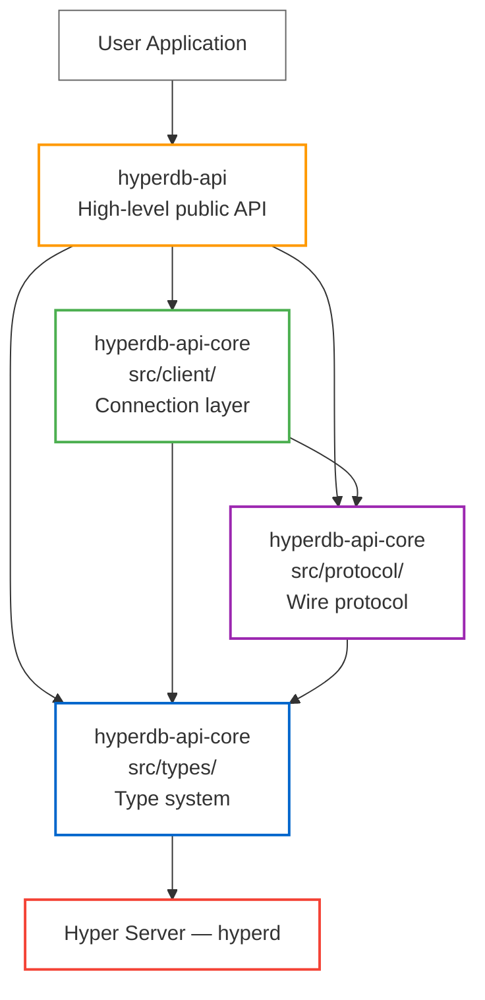
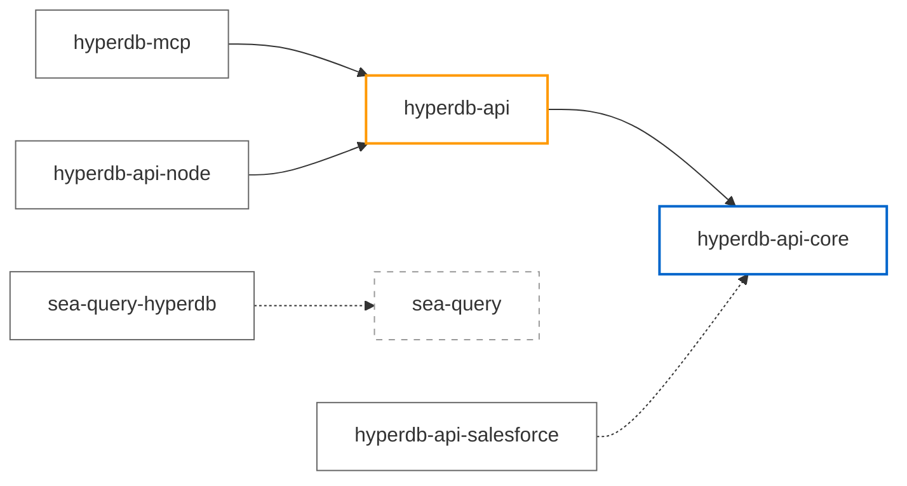
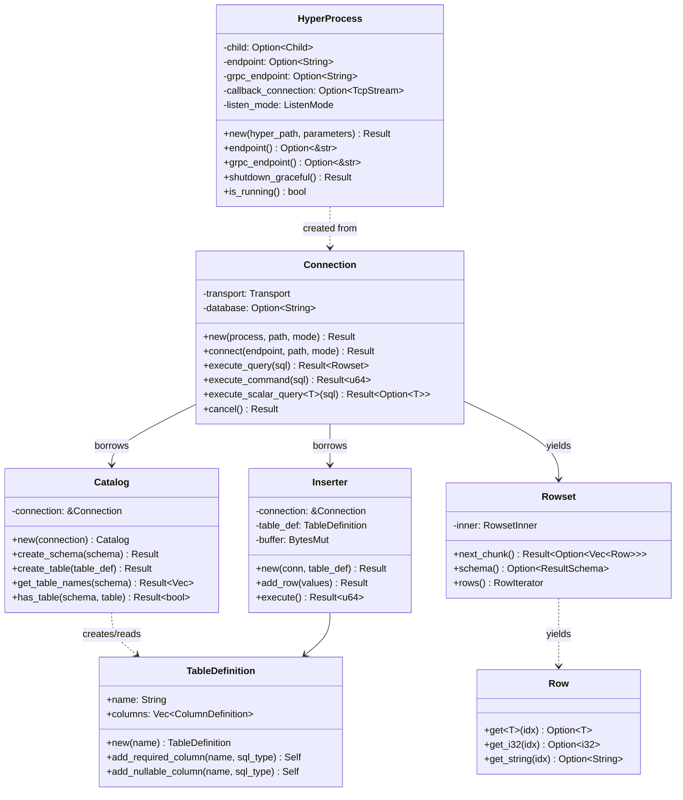

# Development Guide

This guide is for **contributors and developers** working on the Hyper API for Rust.
For end-user documentation, see [README.md](README.md) and [hyperdb-api/README.md](hyperdb-api/README.md).

---

## Architecture Overview

The codebase has two published Rust crates on the critical path — `hyperdb-api` (public) and `hyperdb-api-core` (internal implementation detail) — plus companion crates. `hyperdb-api-core` preserves three internal submodules that contributors navigate independently:



| Layer | Responsibility |
|-------|---------------|
| **`hyperdb-api-core/src/types/`** | Type system foundation: SQL types, OIDs, LittleEndian binary encoding, `ToHyperBinary`/`FromHyperBinary` traits |
| **`hyperdb-api-core/src/protocol/`** | Wire protocol: PostgreSQL-compatible message framing (BigEndian), HyperBinary COPY format, SQL escaping, authentication messages |
| **`hyperdb-api-core/src/client/`** | Connection management: sync/async TCP clients, gRPC transport, TLS (rustls), authentication (MD5, SCRAM-SHA-256, Salesforce OAuth) |
| **`hyperdb-api`** | High-level public API: `Connection`, `Inserter`, `Catalog`, Arrow integration, connection pooling, transactions |

`hyperdb-api-core` publishes to crates.io (Cargo requires it) but is **not a public API** — users should depend on `hyperdb-api` only. See [`hyperdb-api-core/README.md`](hyperdb-api-core/README.md) for the "forever internal" positioning.

Companion crates (optional, add only when needed):

| Crate | Purpose |
|-------|---------|
| **`sea-query-hyperdb`** | HyperDB dialect backend for [sea-query](https://crates.io/crates/sea-query) |
| **`hyperdb-api-salesforce`** | Salesforce Data Cloud OAuth authentication |
| **`hyperdb-mcp`** | MCP server CLI for LLM-driven SQL analytics on `.hyper` files |
| **`hyperdb-bootstrap`** | Downloads the `hyperd` executable from Tableau release packages |
| **`hyperdb-api-node`** | Node.js/TypeScript bindings (napi-rs, published to npm) |

### Crate Dependency Graph



---

## Design Rationale

### Why Pure Rust?

| Category | Benefit |
|----------|---------|
| **Performance** | Zero FFI overhead, better compiler optimization, ~50% faster inserts vs C++ |
| **Developer Experience** | Native Rust idioms (`Result<T>`, `Option<T>`), full rust-analyzer support |
| **Maintenance** | Independent evolution, simpler builds (`cargo build`), no C knowledge required |
| **Future-Proofing** | gRPC transport, WebAssembly compatible, async/await support, connection pooling |
| **Safety** | Memory safety guarantees, no undefined behavior |

### Why No Feature Flags?

The `hyperdb-api` crate has **zero feature flags** — all capabilities (TLS, pooling, geography,
transactions, chrono) are always enabled. This simplifies dependency management and matches
the C++/Python/Java APIs. Domain-specific functionality lives in companion crates instead. This may change before 1.0.0 if it's found that certain feature flags can greatly reduce the number of dependencies for users who don't need them, reduce the overall binary size and build time.

---

## Key Design Decisions

### Lifetime Safety Design

The API uses **lifetime annotations** to provide compile-time guarantees that resources
are used correctly. All dependent types (`Inserter`, `Catalog`, `Rowset`) carry a `'conn`
lifetime tying them to their parent `Connection`:

```
Connection (owns data)
├── Inserter<'conn>
│   └── CopyInWriter<'conn>
├── Catalog<'conn>
└── Rowset<'conn>
```

This is a **simple hierarchical design**, not a complex lifetime web:
- **Single root owner**: `Connection` owns the underlying client
- **Simple borrows**: All dependent types borrow `&'conn Connection`
- **No circular references**: `Inserter` doesn't reference `Catalog`, etc.
- **Single lifetime parameter**: Just one `'conn` needed

The borrow checker enforces that you cannot drop a `Connection` while any dependent
type holds a reference. The `execute(self)` method on `Inserter` takes ownership,
automatically ending the borrow when the insert completes.

See `hyperdb-api/src/lib.rs` crate-level docs for the full explanation with compile-fail
doc test examples.

### Dual Sync/Async Architecture

The codebase provides both synchronous and asynchronous APIs:

- **Sync API**: `Connection`, `Inserter`, `HyperProcess` — blocking I/O, simpler surface
- **Async API**: `AsyncConnection`, `AsyncArrowInserter`, connection pooling — tokio-based

When implementing features, consider whether both sync and async variants need updates.

### Streaming by Default

Query results are **always streaming** to maintain constant memory usage. Results arrive
in 64K-row chunks; the client never materializes the full result set in memory. This makes
it safe for billion-row results without OOM risk.

See `hyperdb-api/src/result.rs` module docs for the streaming design, chunk sizing rationale,
and `rows()` vs `next_chunk()` performance tradeoffs.

### Key Differences from PostgreSQL

Hyper uses the PostgreSQL wire protocol but with key differences:

| Aspect | PostgreSQL | Hyper |
|--------|------------|-------|
| Binary encoding | BigEndian | LittleEndian ("HyperBinary") |
| COPY header | `PGCOPY\n\xff\r\n\0` (11 bytes) | `HPRCPY` + 12 null bytes (18 bytes) |
| Row framing | 2-byte field count prefix per row | No per-row field count |
| NULL encoding | 4-byte `-1` length marker | 1-byte indicator on nullable columns |
| Value encoding | 4-byte length prefix + BigEndian | No length for fixed-size types, LittleEndian |
| Trailer | 2-byte `-1` marker | None |

See `hyperdb-api-core/src/protocol/copy.rs` module docs for the full comparison.

### Safe Escaping for Parameters

Hyper does not support PostgreSQL's native Extended Query protocol (`$1`, `$2` placeholders).
The `query_params()` and `command_params()` methods internally convert parameters to safely
escaped SQL literals. The API uses the `$1` placeholder syntax so that if Hyper adds native
parameter support, user code will benefit without changes.

See `hyperdb-api/src/connection.rs` docs on `query_params()` for the full rationale.

---

## Class Diagram



---

## Dependencies

The Rust Hyper API is built entirely with pure-Rust dependencies:
- **No C compiler required** for builds (except `aws-lc-sys` compiled from source)
- **No system library dependencies** (OpenSSL, etc.)
- **Cross-compilation friendly** (WebAssembly, embedded, etc.)

### Core Library Dependencies (All Pure Rust)

| Category | Crates | Notes |
|----------|--------|-------|
| **Data Handling** | `bytes`, `byteorder`, `memchr` | Binary data manipulation |
| **Error Handling** | `thiserror` | Ergonomic error types |
| **Logging** | `tracing` | Structured logging |
| **Cryptography** | `md-5`, `sha2`, `hmac`, `pbkdf2`, `base64` | RustCrypto implementations |
| **Security** | `rand`, `zeroize` | Secure randomness, memory zeroing |
| **System** | `libc` | Type definitions only (no linking) |

### TLS and Cryptography (Always Enabled)

| Crate | Status | Notes |
|-------|--------|-------|
| `rustls` | Pure Rust | TLS implementation (always-on); PEM parsing via re-exported `pki_types::pem` |
| `webpki-roots` | Pure Rust | Mozilla CA root certificates (bundled) |
| `aws-lc-sys` | C/ASM | Crypto provider for `rustls` (compiled from source) |

### Native Transitive Dependencies

While `hyperdb-api` itself is pure Rust, the TLS and gRPC stacks pull in native
transitive dependencies:

| Crate | Source | Why |
|-------|--------|-----|
| `aws-lc-sys` | `rustls` -> `aws-lc-rs` | AWS-LC cryptographic library. Default crypto provider for `rustls`. Compiles from source. |
| `core-foundation-sys` | `tonic` -> `rustls-native-certs` | macOS only. FFI bindings to Apple's Core Foundation. |
| `security-framework-sys` | `tonic` -> `rustls-native-certs` | macOS only. FFI bindings to Apple's Security framework. |
| `rustls-native-certs` | `tonic` (gRPC) | Loads OS-trusted root CA certificates. |

To inspect these yourself:

```bash
cargo tree -p hyperdb-api -e no-dev | grep -i "sys\|native"
```

### Dev/Test Dependencies

| Crate | Status | Notes |
|-------|--------|-------|
| `tempfile`, `tracing-subscriber`, `tracing-test` | Pure Rust | Testing utilities |
| `sysinfo` | Uses `core-foundation-sys` on macOS | Benchmark dependency only |

### Verifying Dependencies

```bash
# View full dependency tree
cargo tree -p hyperdb-api -e no-dev

# Search for native dependencies (-sys crates)
cargo tree -p hyperdb-api -e no-dev | grep -i "sys\|native\|openssl"

# Comprehensive analysis with cargo-geiger (detects unsafe code)
cargo install cargo-geiger
cargo geiger -p hyperdb-api
```

### Feature Flags

The `hyperdb-api` crate has **no feature flags**. Domain-specific functionality lives
in companion crates:

| Companion Crate | Description | Key Dependencies |
|-----------------|-------------|------------------|
| `sea-query-hyperdb` | HyperDB dialect backend for `sea-query` | `sea-query` |
| `hyperdb-api-salesforce` | Salesforce Data Cloud OAuth | `reqwest`, `jsonwebtoken`, `rsa` |

---

## Building & Development

### Prerequisites

1. **Install Rust** (if not already installed):
   - Linux/macOS: `curl --proto '=https' --tlsv1.2 -sSf https://sh.rustup.rs | sh`
   - Windows: Download from https://rustup.rs/
   - Verify: `cargo --version`

2. **Install Protocol Buffers Compiler** (`protoc`):

   The `hyperdb-api-core` crate uses gRPC and requires `protoc` to compile `.proto` files.

   **Linux:**
   ```bash
   # Ubuntu/Debian
   sudo apt-get install -y protobuf-compiler

   # Fedora/RHEL
   sudo dnf install protobuf-compiler

   # Arch Linux
   sudo pacman -S protobuf
   ```

   **macOS:**
   ```bash
   brew install protobuf
   ```

   **Windows:**
   ```powershell
   # Option 1: Chocolatey
   choco install protoc

   # Option 2: Scoop
   scoop install protobuf

   # Option 3: Manual — download from https://github.com/protocolbuffers/protobuf/releases
   # Extract and add the bin folder to PATH
   ```

   Verify: `protoc --version`

3. **Obtain the `hyperd` executable.** The easiest path is the bundled
   downloader (see [`hyperdb-bootstrap`](hyperdb-bootstrap/README.md)):

   ```bash
   make download-hyperd            # Linux / macOS
   .\build.ps1 download-hyperd     # Windows (PowerShell)
   ```

   This installs `hyperd` at `.hyperd/current/hyperd` (auto-discovered by
   `make`/`build.ps1` — no `HYPERD_PATH` needed). The pinned release is
   baked into [`hyperdb-bootstrap/hyperd-version.toml`](hyperdb-bootstrap/hyperd-version.toml);
   to upgrade, edit that file (version + build_id + per-platform sha256s)
   and bump the crate version. Pass `ARGS="--latest"` to fetch the newest
   release via best-effort scraping, or `ARGS="--version X --build-id Y"`
   for an ad-hoc pin.

   If you already have a `hyperd` elsewhere, set `HYPERD_PATH` instead:

   ```bash
   export HYPERD_PATH=/path/to/hyperd
   ```

   **Setting `HYPERD_PATH` is always an opt-out of the downloader.** If
   you already have a `hyperd` and want to use it, export `HYPERD_PATH`
   and the auto-discovery chain short-circuits — nothing is fetched,
   and no build step touches the network.

   If `HYPERD_PATH` is unset and no `hyperd` is found on disk, the
   wrappers auto-run `download-hyperd` the first time you run a target
   that actually needs `hyperd` (build, test, examples, doc). Subsequent
   runs are cache hits. Read-only targets (`help`, `clean*`) never
   trigger the download.

   | Action | Network? | Behavior |
   |--------|----------|----------|
   | `make build` / `make test` / `make examples` / `make doc` | Only on first run with no hyperd | Uses `HYPERD_PATH` if set, else `.hyperd/current/hyperd`. If neither is found, `download-hyperd` runs as a dependency first. |
   | `./run_all_examples.sh` / `./run_examples_wsl.sh` / `.\build.ps1 <cmd>` | Only on first run with no hyperd | Same priority. Auto-runs the downloader if nothing is on disk. |
   | `make help` / `make clean` / `make clean-*` | No | Never trigger auto-download. |
   | Plain `cargo build` / `cargo test` | No | Uses `HYPERD_PATH` at runtime. Will error if it's unset. The Makefile/wrappers are what resolve it for you. |
   | `cargo build -p hyperdb-bootstrap` | No | Runs `build.rs`, which validates `hyperd-version.toml` locally. |
   | `make download-hyperd` | **Yes** | User-initiated. Downloads the pinned release, extracts into `.hyperd/current/`. |
   | `make verify-hyperd-pin` (and the matching CI workflow) | **Yes** | User/CI-initiated. HEADs all 4 platform URLs. Writes no files. |

   Tuning the downloader (all flags go through `ARGS=...` with `make`, or
   after the `build.ps1 download-hyperd` command):

   ```bash
   # Best-effort scrape of the latest release (skips sha256 verification).
   make download-hyperd ARGS="--latest"

   # Pin to a specific release ad-hoc.
   make download-hyperd ARGS="--version 0.0.24457 --build-id rc36858b6"

   # Install to a custom location, e.g. shared across repos.
   make download-hyperd ARGS="--dest /opt/hyperd"

   # Re-download even when the version is already cached.
   make download-hyperd ARGS="--force"
   ```

   Bumping the baked-in pin is an edit to
   [`hyperdb-bootstrap/hyperd-version.toml`](hyperdb-bootstrap/hyperd-version.toml)
   (version + build_id + per-platform sha256s) plus a crate version bump.
   `build.rs` validates the file on every compile, and the
   `verify-hyperd-pin` CI workflow confirms the URLs resolve.

4. **Windows only**: Install Visual Studio Build Tools with "Desktop development with C++"
   workload (provides the MSVC linker, not for C++ compilation).

### Building on Linux/macOS

#### Using the Makefile (Recommended)

The `Makefile` automatically sets up all required environment variables:

```bash
make build              # Debug build (API + MCP)
make build-api          # Debug build (API only, no MCP/Node)
make build-release      # Release build (API + MCP)
make build-api-release  # Release build (API only, no MCP/Node)
make test               # Run tests (debug, API + MCP)
make test-api           # Run tests (debug, API only, no MCP/Node)
make test-release       # Run tests (release, API + MCP)
make test-api-release   # Run tests (release, API only, no MCP/Node)
make examples           # Run all examples
make doc                # Generate documentation
make clean              # Remove build artifacts and test files
make clean-test-files   # Remove only test-generated .hyper and log files
make help               # Show all targets
```

#### Manual Build Commands

```bash
export HYPERD_PATH=/path/to/hyperd
cargo build
cargo test -p hyperdb-api
```

### Building on Windows

#### Using the PowerShell Script (Recommended)

```powershell
.\build.ps1 help            # Show available commands
.\build.ps1 build           # Debug build (API + MCP)
.\build.ps1 build-api       # Debug build (API only, no MCP/Node)
.\build.ps1 build-release   # Release build (API + MCP)
.\build.ps1 build-api-release # Release build (API only, no MCP/Node)
.\build.ps1 test            # Run tests (debug, API + MCP)
.\build.ps1 test-api        # Run tests (debug, API only, no MCP/Node)
.\build.ps1 test-release    # Run tests (release, API + MCP)
.\build.ps1 test-api-release # Run tests (release, API only, no MCP/Node)
.\build.ps1 examples        # Run all examples
.\build.ps1 doc             # Generate and open documentation
.\build.ps1 clean           # Remove build artifacts and test files
```

#### Manual Commands

```powershell
$env:HYPERD_PATH = "D:\path\to\hyperd.exe"
cargo build
cargo test -p hyperdb-api
```

#### Windows-Specific Notes

- **Command separators**: PowerShell uses `;` not `&&`
- **Script execution policy**: If blocked, run `Set-ExecutionPolicy -ExecutionPolicy RemoteSigned -Scope CurrentUser`

| Issue | Solution |
|-------|----------|
| "cargo: command not found" | Restart terminal or add `C:\Users\<Username>\.cargo\bin` to PATH |
| "hyperd not found" | Set `$env:HYPERD_PATH` to your `hyperd` executable |
| "linking with link.exe failed" | Install Visual Studio Build Tools |
| Doctest fails with `Couldn't run the test: Access is denied. (os error 5) - maybe your tempdir is mounted with noexec?` | Windows Defender holding an exclusive scan lock on a freshly compiled doctest `.exe`. `.\build.ps1 test-release` already serializes doctests to mitigate the race; for a permanent fix run once in an admin PowerShell: `Add-MpPreference -ExclusionPath '<repo>\target'` |

### Building in WSL

WSL provides a Linux environment on Windows:

```bash
# Setup
wsl --install    # PowerShell as Administrator
sudo apt-get update && sudo apt-get install -y build-essential protobuf-compiler
curl --proto '=https' --tlsv1.2 -sSf https://sh.rustup.rs | sh
source $HOME/.cargo/env

# Build (best perf: clone inside WSL filesystem, not /mnt/c/)
cd ~/hyper-api-rust
export HYPERD_PATH=/path/to/hyperd
cargo build --release
```

### Cross-Platform Reference

| Task | Linux/macOS | Windows |
|------|-------------|---------|
| Build debug (all) | `make build` | `.\build.ps1 build` |
| Build debug (API only) | `make build-api` | `.\build.ps1 build-api` |
| Build release (all) | `make build-release` | `.\build.ps1 build-release` |
| Build release (API only) | `make build-api-release` | `.\build.ps1 build-api-release` |
| Run tests (all) | `make test` | `.\build.ps1 test` |
| Run tests (API only) | `make test-api` | `.\build.ps1 test-api` |
| Run examples | `./run_all_examples.sh` | `.\run_all_examples.ps1` |
| Generate docs | `make doc` | `.\build.ps1 doc` |
| Clean | `make clean` | `.\build.ps1 clean` |

---

## Testing

### Running Tests

```bash
# Run all tests
make test

# Or manually, per crate:
cargo test -p hyperdb-api-core
cargo test -p hyperdb-api-core
cargo test -p hyperdb-api-core
cargo test -p hyperdb-api

# Run a specific test
cargo test -p hyperdb-api test_name

# Run a specific integration test file
cargo test -p hyperdb-api --test integration_test
```

### Test Structure

```
hyperdb-api/tests/           # Integration tests (high-level API)
hyperdb-api/tests/common/    # Shared test utilities
hyperdb-api-core/tests/       # Client-level integration tests
hyperdb-api-core/src/protocol/       # Unit tests (inline with code)
hyperdb-api-core/src/types/          # Unit tests (inline with code)
```

**Test utilities:**
- `hyperdb-api/tests/common/mod.rs` — shared test helpers
- `hyperdb-api-core/src/client/test_util.rs` — client test utilities
- Both use `HyperProcess::new()` to start temporary `hyperd` servers

Tests create temporary `.hyper` files and clean them up automatically.
Use `make clean-test-files` to remove any leftover test artifacts.

### Stress Testing

A Monte Carlo stress test simulates multiple user classes (inserters, query users, mixed)
hitting separate databases concurrently, with stochastic operation selection and
seed-based deterministic replay.

```bash
# Default 5-minute stress test:
cargo test -p hyperdb-api --test stress_test -- --ignored --nocapture

# Custom high-load run:
STRESS_DURATION=3600 STRESS_DATABASES=5 STRESS_INSERTER_USERS=10 \
  STRESS_QUERY_USERS=8 STRESS_MIXED_USERS=4 STRESS_SEED=42 \
  cargo test -p hyperdb-api --test stress_test stress_test_tcp_hyperbinary -- --ignored --nocapture

# Replay a previous run to reproduce a failure:
STRESS_REPLAY_FILE=/tmp/stress_run/replay.json \
  cargo test -p hyperdb-api --test stress_test stress_test_replay -- --ignored --nocapture
```

Each run produces `summary.json` and `replay.json` for deterministic reproduction.
See [Stress Test Documentation](hyperdb-api/tests/stress_test/README.md) for full details.

### Formal Verification with Kani

The project includes [Kani Rust Verifier](https://model-checking.github.io/kani/)
proof harnesses that use model checking to formally verify correctness properties.
Unlike tests which check specific inputs, Kani exhaustively verifies properties over
**all possible inputs**.

#### What is verified

| Crate | Harnesses | Properties Verified |
|-------|-----------|---------------------|
| **hyperdb-api-core (types)** | 12 | LE byte roundtrips, `Date` encode/decode, `from_le_bytes` totality, size constants |
| **hyperdb-api-core (protocol)** | 32 | COPY read no-panic on arbitrary input, read roundtrips, short-buffer errors, `ParseError` no-panic, identifier validation |
| **hyperdb-api** | 1 | `PG_IDENTIFIER_LIMIT` constant correctness |

#### Running Kani

```bash
# Install Kani
cargo install --locked kani-verifier
cargo kani setup

# Run a single harness (~1 second)
cargo kani -p hyperdb-api-core --harness bool_roundtrip

# Run all harnesses for a crate
cargo kani -p hyperdb-api-core
cargo kani -p hyperdb-api-core
cargo kani -p hyperdb-api
```

Proof harness locations:
- `hyperdb-api-core/src/types/proofs.rs` — type roundtrips, Date arithmetic, size constants
- `hyperdb-api-core/src/protocol/proofs.rs` — COPY read safety, protocol type parsing, identifier validation
- `hyperdb-api/src/proofs.rs` — name/identifier constants

All harnesses are gated behind `#[cfg(kani)]` and have zero impact on normal builds.

#### Known Kani Limitations

- **`BytesMut`** — The `bytes` crate internals are too complex for the solver. Write-side roundtrips are verified at the byte level instead.
- **`Box<dyn Error>`** — Dynamic dispatch causes infinite unwinding. Harnesses use concrete error types.
- **`format!` / heap allocation** — String formatting and allocation are too complex. Escaping correctness is covered by unit tests.

#### Bug Found by Kani

Kani discovered an arithmetic overflow in `Date::encode()` and `Date::to_julian_day()`
when `days` is at extreme `i32` values. This was fixed with `wrapping_add`/`wrapping_sub`
in `hyperdb-api-core/src/types/special.rs`.

---

## Performance

### Benchmark Results

**100M rows, 4 columns, optimized hyperd:**

| Operation | Throughput | Notes |
|-----------|-----------|-------|
| Insert (single-threaded) | 22M rows/sec | `Inserter`, HyperBinary format |
| Insert (multi-threaded) | 24M rows/sec | `ChunkSender`, 14 workers |
| Full table scan | 18M rows/sec | Streaming, 64K row chunks |
| Filtered query (10M rows) | 19M rows/sec | Single sensor_id filter |
| Aggregation | 0.04s | Server-side GROUP BY |

**Insert Comparison (100M rows):**

| Metric | Single-Threaded (`Inserter`) | Multi-Threaded (`ChunkSender`) |
|--------|------------------------------|--------------------------------|
| Time | ~4.5s | ~4.2s |
| Throughput | ~22M rows/sec | ~24M rows/sec |
| MB/sec | ~505 MB/sec | ~545 MB/sec |
| Memory | ~23 MB | ~1.3 GB (queued chunks) |
| Speedup | baseline | 1.08-1.10x |

**Memory Behavior:**
- Insert (single-threaded): ~23 MB constant (16 MB chunk streaming)
- Insert (multi-threaded): ~1.3 GB avg (queued chunks across workers)
- Query: ~22 MB constant (64K row chunks) regardless of result set size
- Safe for billion-row results without OOM

### Running Benchmarks

```bash
export HYPERD_PATH=/path/to/hyperd
cargo run -p hyperdb-api --release --example benchmark          # 10M rows (default)
cargo run -p hyperdb-api --release --example benchmark 100000000 # 100M rows
```

**gRPC benchmarks:**

```bash
# Quick sanity check (1M rows)
cargo test --release --test grpc_benchmark_tests benchmark_quick -- --nocapture

# Full scale comparison (100K to 100M rows)
cargo test --release --test grpc_benchmark_tests benchmark_all_modes_all_scales -- --nocapture --test-threads=1

# Complex workload (100M rows x 12 columns, ~1.5 GB)
cargo test --release --test grpc_benchmark_tests benchmark_100m_complex -- --nocapture --test-threads=1
```

### Performance Comparison: Rust vs C++

**100M rows:**

| Metric | C++ | Rust (single) | Rust (multi) | Winner |
|--------|-----|---------------|--------------|--------|
| Insert throughput | 15.8M rows/sec | 22M rows/sec | 24M rows/sec | Rust (+52%) |
| Query throughput | 17.4M rows/sec | 18M rows/sec | -- | Rust (+3%) |
| Memory (insert) | ~similar | 23 MB | ~1.3 GB | Rust (single) |
| Memory (query) | ~25 MB | ~22 MB | -- | Equal |

See [docs/BENCHMARK_GUIDE.md](docs/BENCHMARK_GUIDE.md) for benchmark
methodology and reproduction instructions.

---

## Rust API vs C++ API Comparison

The Rust API is **API-compatible** with the C++ Hyper API while being idiomatic Rust.

### Type Mapping

| C++ Type | Rust Type | Notes |
|----------|-----------|-------|
| `hyperdb_api::HyperProcess` | `HyperProcess` | Same |
| `hyperdb_api::Connection` | `Connection` | Same |
| `hyperdb_api::Catalog` | `Catalog` | Same |
| `hyperdb_api::Inserter` | `Inserter` | Same |
| `hyperdb_api::TableDefinition` | `TableDefinition` | Same |
| `hyperdb_api::Result` | `Rowset` | Streaming by default |
| `hyperdb_api::Row` | `StreamRow` | With generic `get::<T>()` |
| `hyperdb_api::SqlType` | `SqlType` | Same |
| `hyperdb_api::Name` | `Name` | Same |

### Method Mapping

| Operation | C++ | Rust |
|-----------|-----|------|
| Query | `conn.executeQuery(sql)` | `conn.execute_query(sql)` |
| Command | `conn.executeCommand(sql)` | `conn.execute_command(sql)` |
| Scalar | `conn.executeScalarQuery<T>(sql)` | `conn.execute_scalar_query::<T>(sql)` |
| Insert row | `inserter.add(v1).add(v2).endRow()` | `inserter.add_row(&[&v1, &v2])` |
| Get value | `row.get<T>(col)` | `row.get::<T>(col)` |

### Key Differences

| Aspect | C++ | Rust | Why |
|--------|-----|------|-----|
| Error handling | Exceptions | `Result<T, Error>` | Idiomatic Rust |
| Null handling | `optional<T>` | `Option<T>` | Idiomatic Rust |
| Insert API | Chained `.add().endRow()` | `add_row(&[...])` or chained | Both supported |
| Query iteration | Range-for loop | `rows()` or `next_chunk()` | Simple or batch |
| Streaming | Implicit | Implicit | Both stream by default |
| Lifetimes | RAII | Borrow checker + RAII | Compile-time safety |

---

## Features Implemented

- HyperProcess with callback connection (graceful shutdown, no orphan processes)
- Synchronous and asynchronous APIs
- COPY protocol for high-performance bulk insertion
- Streaming query results (constant memory for billion-row results)
- C++-like `rows()` iterator and chunked iteration patterns
- HyperBinary encoding (LittleEndian)
- SQL type system with OID mapping
- MD5 and SCRAM-SHA-256 authentication
- Name escaping and safe SQL identifiers
- Schema introspection via information_schema
- Column mappings with SQL expressions
- Geography type with geo-types/geozero integration
- TLS/SSL support via rustls
- Structured logging via `tracing` crate
- Query cancellation (thread-safe)
- Server parameter access and notice receiver callbacks
- Arrow IPC stream format for insertion and query results
- Async API with connection pooling (deadpool)
- gRPC transport with Arrow IPC results
- SeaQuery support via `sea-query-hyperdb` companion crate
- Salesforce Data Cloud OAuth via `hyperdb-api-salesforce` companion crate
- Formal verification with Kani proof harnesses
- Transactions

## Future Enhancements

- Bazel build integration with rules_rust
- Extended query protocol (parameterized prepared statements)

---

## Project History

**Date:** 2025-12-05 - 2025-12-30

**Author:** Stefan Steiner (ssteiner@salesforce.com) with AI assistance (Cursor/Claude)

This project explored how far AI-assisted development could go in creating a full Hyper API
Rust implementation. The author, one of the original Hyper API development team members,
knew the Hyper API well but had limited Rust experience. Most work was done during off-hours
and Christmas holidays, with 80% completed over four separate evenings.

The initial approach wrapped the Hyper API C library (like other language APIs), but after
discussion with Adrian Vogelsgesang, the direction shifted to a pure-Rust implementation
using the PostgreSQL wire protocol with Hyper Binary encoding — similar to the new Hyper JDBC
driver's pure-Java approach. Patterns from
[sfackler/rust-postgres](https://github.com/sfackler/rust-postgres) (MIT/Apache-2.0) shaped
the protocol layer; see the [Attribution](#attribution) section below and
[`NOTICE`](NOTICE) for full third-party attribution.

---

## Attribution

> **Canonical legal-compliance attribution lives in [`NOTICE`](NOTICE) at the
> repo root.** This section is developer-facing context: which upstream
> projects shaped this codebase and how. For the upstream copyright notices
> and reproduced license text, see `NOTICE`.

### Code Adapted From Upstream Projects

Some files in [`hyperdb-api-core/src/`](hyperdb-api-core/src/) contain code
adapted from third-party Rust crates. The adaptation is substantive (variable
names, constant names, struct shapes, distinctive comments) and triggers the
upstream licenses' attribution requirement. Per-file source-level credits live
in those files' module-level doc comments; the comprehensive list with the
upstream license text is in [`NOTICE`](NOTICE).

- **[sfackler/rust-postgres](https://github.com/sfackler/rust-postgres)** —
  `postgres-protocol`, `tokio-postgres`, `postgres-types` (MIT or Apache-2.0).
  Adapted into `hyperdb-api-core/src/{client/auth.rs, protocol/message/backend.rs,
  protocol/message/frontend.rs, types/oid.rs, client/row.rs}`. Hyper-specific
  changes added on top (HyperBinary COPY format, gRPC transport, Hyper OIDs,
  zeroize-based crypto memory hygiene, performance work).

### Patterns Inspired By (No Code Adapted)

These crates informed API surface and idiom choices but no code, distinctive
comments, or fingerprintable variable names were reproduced. Their licenses do
not apply to this project.

- **[SQLx](https://github.com/launchbadge/sqlx)** (MIT or Apache-2.0) —
  Inspired the `fetch_one()` / `fetch_optional()` / `fetch_all()` /
  `fetch_scalar()` convenience-method shape on `Connection` and `Transaction`.
- **[Diesel](https://diesel.rs/)** (MIT or Apache-2.0) — Informed
  builder-pattern ergonomics in `TableDefinition` and the `ConnectionBuilder`
  family.
- **[SeaORM](https://www.sea-ql.org/SeaORM/)** (MIT or Apache-2.0) —
  Informed modern Rust async patterns for database operations.

### Dependencies

This project uses standard Rust ecosystem crates licensed under MIT or Apache-2.0.
All dependencies are listed in `Cargo.toml` and `Cargo.lock`.

Key dependency categories:
- **Data handling**: `bytes`, `byteorder`, `memchr`
- **Error handling**: `thiserror`
- **Logging**: `tracing`
- **Cryptography**: `md-5`, `sha2`, `hmac`, `pbkdf2`, `base64` (RustCrypto)
- **Security**: `rand`, `zeroize`
- **TLS**: `rustls`, `webpki-roots` (pure Rust, always-on)
- **Geography**: `geo-types`, `wkt`, `geozero` (always-on)

For a complete list: `cargo tree -p hyperdb-api`

---

## Related Documents

| Document | Description |
|----------|-------------|
| [README.md](README.md) | End-user quick start and overview |
| [hyperdb-api/README.md](hyperdb-api/README.md) | `hyperdb-api` crate user guide (crates.io landing page) |
| [CONTRIBUTING.md](CONTRIBUTING.md) | How to contribute |
| [AGENTS.md](AGENTS.md) | AI coding assistant guidance |
| [docs/README.md](docs/README.md) | Index of all `docs/` files with one-line scope descriptions |
| [docs/RUST_GUIDELINES.md](docs/RUST_GUIDELINES.md) | Rust coding standards (lints, API design, error handling, exceptions) |
| [docs/RUST_DOCUMENTATION_STYLE.md](docs/RUST_DOCUMENTATION_STYLE.md) | Documentation style guide |
| [docs/TRANSACTIONS.md](docs/TRANSACTIONS.md) | Transaction API design |
| [docs/BENCHMARK_GUIDE.md](docs/BENCHMARK_GUIDE.md) | How to run benchmarks |

Per-crate DEVELOPMENT.md files:
- [hyperdb-api/DEVELOPMENT.md](hyperdb-api/DEVELOPMENT.md)
- `hyperdb-api-core/docs/`: [DEVELOPMENT-client.md](hyperdb-api-core/docs/DEVELOPMENT-client.md), [DEVELOPMENT-protocol.md](hyperdb-api-core/docs/DEVELOPMENT-protocol.md), [DEVELOPMENT-types.md](hyperdb-api-core/docs/DEVELOPMENT-types.md)
- [hyperdb-api-salesforce/DEVELOPMENT.md](hyperdb-api-salesforce/DEVELOPMENT.md)
- [sea-query-hyperdb/DEVELOPMENT.md](sea-query-hyperdb/DEVELOPMENT.md)
- [hyperdb-mcp/DEVELOPMENT.md](hyperdb-mcp/DEVELOPMENT.md)
