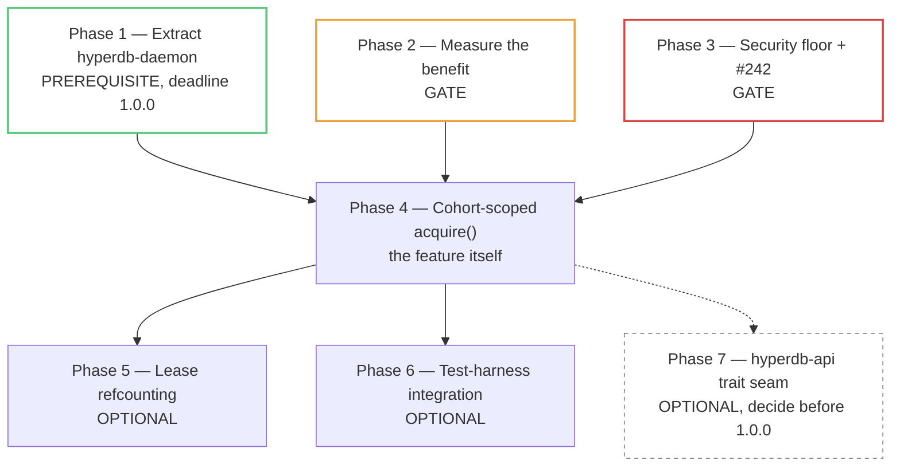

# Shared `hyperd` Daemon — Phased Implementation Plan

> **For agentic workers:** REQUIRED SUB-SKILL: use
> `superpowers:subagent-driven-development` and execute this plan phase by
> phase. Steps use checkbox (`- [ ]`) syntax for tracking. The main thread owns
> plan revision, commits, final validation, and merge-readiness judgment.
>
> **This plan is not approved.** It accompanies a design *exploration*, and its
> design spec recommends against building most of it in the near term. Phase 1
> is recommended unconditionally. Phases 2 and 3 are gates. Phases 4 onward
> should not start until those gates pass and a human has answered the decision
> points in the "Decisions a human must make" section below.

**Goal:** Lift the resident `hyperd` daemon out of `hyperdb-mcp` into a crate
whose job it is, narrowing `hyperdb-mcp`'s accidental public surface before the
`1.0.0` freeze; then, only if measurement and a security floor justify it,
offer cohort-scoped shared-engine acquisition to any `hyperdb-api` consumer.

**Architecture:** A new `hyperdb-daemon` crate sitting **above** `hyperdb-api`,
mirroring `hyperdb-bootstrap`'s library-plus-`cli`-feature shape. It owns
discovery, the control protocol, the supervisor, and the daemon binary.
`hyperdb-mcp` depends on it and keeps all of its own policy. `hyperdb-api`
gains nothing in the minimum viable slice, because
`Connection::connect(endpoint, …)` already covers connecting to a `hyperd`
someone else owns.

**Tech stack:** Rust workspace, edition 2024, MSRV 1.88; `hyperdb-api`;
`hyperdb-mcp`; `serde`/`serde_json` for the discovery record; `clap` behind a
`cli` feature; real `hyperd` via `HYPERD_PATH=~/dev/bin/hyperd`; Conventional
Commits; release-please owns all versions.

**Design specification:**
[`docs/superpowers/specs/2026-09-06-shared-hyperd-daemon-api-design.md`](../specs/2026-09-06-shared-hyperd-daemon-api-design.md)

**Base:** `upstream/main` @ `2f31b9e`
**Branch (design only):** `docs/shared-hyperd-daemon-design`
**Branch (implementation):** not created; each phase below should get its own.

---

## Phase dependency map



| Phase | Status | Blocks | Deadline |
|---|---|---|---|
| 1 — Extract `hyperdb-daemon` | **Prerequisite** | 4 | **`1.0.0`** (removes `pub mod daemon`) |
| 2 — Measure benefit | **Gate** | 4 | none |
| 3 — Security floor and #242 | **Gate** | 4 | none |
| 4 — Cohort-scoped `acquire()` | Feature | 5, 6 | none, land after `1.0.0` |
| 5 — Lease refcounting | Optional | — | none |
| 6 — Test-harness integration | Optional | — | none |
| 7 — `hyperdb-api` trait seam | Optional | — | **`1.0.0`** if chosen at all |

**Phase 1 is worth executing even if every other phase is rejected.** It
answers open issue #276 and its cost rises at the freeze.

---

## Global constraints

These apply to every phase and every agent.

- Read and obey [`AGENTS.md`](../../../AGENTS.md) and the design spec before
  editing. Search the whole repository before concluding a surface is absent.
- **Never invent `hyperd` flags or engine parameters.** Obtain `hyperd` via
  `make download-hyperd`; start servers through `HyperProcess::new` or the
  Makefile targets. Confirm any flag against `hyperd --help` first. Fabricated
  parameters have previously made hanging tests look green.
- **A command is green only when its real output and zero exit status were
  seen.** No output for roughly 30 s is a hang/failure requiring
  investigation, not a pass. These tests start a real `hyperd` subprocess, so a
  misconfigured server hangs rather than erroring cleanly.
- Hyper-backed commands use `HYPERD_PATH=~/dev/bin/hyperd`, or go through
  `make test` which sets it.
- No narrowing integer `as` casts. Use `TryFrom` with an explicit
  error/panic policy. Convert any you touch, even if unrelated to the change.
- Do not edit crate versions, `version.txt`, `.release-please-manifest.json`,
  `release-please-config.json`, or the root `CHANGELOG.md`. No `Release-As:`
  footers.
- Run `npx markdownlint-cli2` with **no arguments** before every commit that
  touches Markdown. Baseline is **0 issues in 68 files**. A nested
  `.markdownlint.json` must `extends` the root config.
- Developer and tester agents do not commit. The main thread stages explicit
  paths and makes the Conventional Commit after an independent reviewer has no
  unresolved Critical or Important finding.
- Role separation is mandatory: **doer ≠ validator ≠ merger.**

## Execution protocol

For every behavioural task:

1. A **tester** agent owns the named test files and proves each planned
   assertion fails against the current branch for the intended reason. Capture
   the harness's nonzero executed-test count; a Cargo filter reporting zero
   tests is a **failed gate** even when Cargo exits zero. Use `-- --exact` when
   selecting one fully qualified test. Where a genuinely new interface makes
   the first red a compiler error, capture that nonzero compiler failure first,
   then add the smallest signature seam and rerun for an executed failing
   assertion.
2. An **engineer** agent owns the named production files and makes the
   proven-red test green with the smallest conforming change.
3. The engineer runs the focused suite plus:

   ```bash
   cargo fmt --all --check
   cargo clippy --workspace --all-targets --all-features -- -D warnings
   ```

4. A fresh read-only **reviewer** receives the spec section, the complete
   diff, and the captured red/green/lint output, and reports
   Critical/Important/Minor plus a merge verdict.
5. Critical/Important findings return to a fresh engineer, then a fresh
   re-review. The main thread independently verifies every claimed fix.

**Pure-move refactors are an explicit exception to red-before-green.** Phase 1
is a relocation, so its evidence is that the *existing* daemon test suite
passes unchanged against the new crate, plus a compile-fail assertion that the
old path is gone. Those are characterizations and must be reported as such,
never dressed up as red tests.

## File map

| Area | Primary files | Phase |
|---|---|---|
| New crate skeleton | `hyperdb-daemon/Cargo.toml`, `src/lib.rs`, `src/main.rs`, root `Cargo.toml` | 1 |
| Moved daemon modules | `hyperdb-daemon/src/{discovery,health,run,spawn}.rs` | 1 |
| MCP rewiring | `hyperdb-mcp/src/{lib,main,engine,server,watcher,diagnostics}.rs`, `Cargo.toml` | 1 |
| Moved daemon tests | `hyperdb-daemon/tests/`, `hyperdb-mcp/tests/daemon_tests.rs` | 1 |
| Startup benchmark | `hyperdb-api/benches/` or `hyperdb-daemon/benches/`, `docs/BENCHMARK_GUIDE.md` | 2 |
| Transport and permissions | `hyperdb-daemon/src/{discovery,health,run}.rs`, `hyperdb-api/src/process.rs` | 3 |
| Wedged-engine recovery | `hyperdb-daemon/src/run.rs` | 3 |
| Acquisition API | `hyperdb-daemon/src/{acquire,cohort,options}.rs` | 4 |
| Leases | `hyperdb-daemon/src/{health,run}.rs` | 5 |
| Test harness | `hyperdb-api/tests/common/mod.rs`, `hyperdb-api-core/tests/common/mod.rs` | 6 |
| Trait seam | `hyperdb-api/src/{connection,process}.rs` | 7 |

---

## Phase 1 — Extract `hyperdb-daemon` (prerequisite; deadline `1.0.0`)

**Why now:** answers open issue #276, which asks whether
`hyperdb_mcp::daemon::health` should be public before 1.0. Removing
`pub mod daemon` from `hyperdb-mcp` after `1.0.0` is a major version. Doing it
before is free. This phase stands alone.

**Scope discipline:** this is a **move**, not a redesign. Do not fix bugs, do
not rename functions, do not change the wire format. Any improvement noticed
along the way becomes an issue, not a diff hunk. A refactor that also changes
behaviour cannot be reviewed as either.

### 1.1 Create the crate and move the modules

- [ ] Add `hyperdb-daemon` to the root `Cargo.toml` workspace members. Use
      `version.workspace = true` — never hand-edit a crate version.
- [ ] Mirror `hyperdb-bootstrap`'s manifest shape exactly:
      `default = ["cli"]`, `cli = ["dep:clap", …]`, so the crate is usable as a
      pure library with `default-features = false`. Confirm the real feature
      list against
      [`hyperdb-bootstrap/Cargo.toml`](../../../hyperdb-bootstrap/Cargo.toml)
      rather than copying this line.
- [ ] Depend on `hyperdb-api`. **Verify no cycle** — `hyperdb-api` must not
      gain a dependency on `hyperdb-daemon`, now or later.
- [ ] Move `hyperdb-mcp/src/daemon/{discovery,health,run,spawn,mod}.rs` to
      `hyperdb-daemon/src/`, preserving inline test modules verbatim.
- [ ] Move the daemon binary entry point out of `hyperdb-mcp/src/main.rs` into
      `hyperdb-daemon/src/main.rs`, behind the `cli` feature.
- [ ] Replace MCP-branded identifiers with injected values: the
      `PONG_TOKEN = "hyperdb-mcp"` and the `MCP_VERSION`-derived
      `DaemonBuildIdentity` become constructor parameters, so `hyperdb-mcp`
      supplies its own and the crate has no product branding. **This is the one
      permitted behaviour-adjacent change in Phase 1** — the token must remain
      byte-identical on the wire for MCP callers, and a test must pin that.
- [ ] Leave `HYPERDB_STATE_DIR`, `HYPERDB_DAEMON_PORT`, and
      `HYPERDB_DAEMON_IDLE_TIMEOUT` spelled exactly as they are. They are a
      public interface.

### 1.2 Rewire `hyperdb-mcp` and narrow its surface

- [ ] Update `engine.rs`, `server.rs`, `watcher.rs`, `diagnostics.rs`, and
      `main.rs` to use `hyperdb_daemon::*`.
- [ ] **Delete `pub mod daemon;` from `hyperdb-mcp/src/lib.rs`.** This is the
      point of the phase.
- [ ] Decide, and record in the commit message, whether `hyperdb-mcp`
      re-exports anything for compatibility. Recommendation: **no re-export.**
      Issue #276 established that no downstream library consumer is known, and
      a re-export preserves the surface this phase exists to remove.
- [ ] Confirm the MCP keeps every piece of policy: `AttachRegistry` replay, the
      `"persistent"` alias and ephemeral scratch, `_table_catalog`, the KV
      store, watched directories, the doctor, and its version-takeover UX.
      Nothing policy-shaped moves into the new crate.

### 1.3 Prove the move preserved behaviour

- [ ] Move `hyperdb-mcp/tests/daemon_tests.rs` to `hyperdb-daemon/tests/`,
      keeping every test name. Leave MCP-integration cases behind in
      `hyperdb-mcp/tests/`.
- [ ] **Un-`ignore` the eight crash-and-restart tests on Linux and Windows** if
      #279's `cfg_attr(target_os = "macos", …)` narrowing did not already reach
      them in the new location. Do not silently re-broaden the ignore during the
      move; that regression is exactly what #271 was.
- [ ] Add a characterization pinning the wire format across the move:
      a `daemon.json` fixture written by `hyperdb-mcp` at `2f31b9e` must
      deserialize byte-identically in the new crate, and the new crate's output
      must deserialize in the old reader. **Report as a passing
      characterization, not as red-before-green.**
- [ ] Add a test asserting `PING` still answers with the MCP's exact token when
      the MCP supplies it, so 1.1's de-branding cannot change the wire.
- [ ] Run and capture:

  ```bash
  cargo fmt --all --check
  cargo clippy --workspace --all-targets --all-features -- -D warnings
  HYPERD_PATH=~/dev/bin/hyperd cargo test -p hyperdb-daemon -- --nocapture
  HYPERD_PATH=~/dev/bin/hyperd cargo test -p hyperdb-mcp
  HYPERD_PATH=~/dev/bin/hyperd cargo test --workspace --exclude hyperdb-api-node --exclude hyperdb-bootstrap
  npx markdownlint-cli2
  ```

  Expected: all green, with the **same** daemon test names passing as before
  the move and the previously-ignored eight now executing on Linux. Record
  passed/failed/ignored counts before and after; an ignored count that grew is
  a failed gate.

### 1.4 Documentation and changelog

- [ ] Create `hyperdb-daemon/README.md` (user-facing) and
      `hyperdb-daemon/CHANGELOG.md` with a single `## [Unreleased]` section.
- [ ] Add the crate to the architecture diagram and the "Subdirectory guidance"
      and layering sections of [`AGENTS.md`](../../../AGENTS.md), and to the
      per-crate changelog list in reminder 8 — it becomes the **tenth**
      hand-maintained changelog.
- [ ] **Changelog entries needed:**
  - `hyperdb-mcp/CHANGELOG.md`, under the existing `## [Unreleased]` →
    `### Removed`: the `daemon` module is no longer public. Append to the
    existing heading if one is there; a second `### Removed` sibling trips
    MD024.
  - `hyperdb-daemon/CHANGELOG.md` → `### Added`: initial release.
- [ ] Reference issue #276 in the commit body so the extraction is traceable to
      the question it answers.
- [ ] Commit: `refactor(daemon)!: extract the resident hyperd daemon into its own crate`

  Note the `!` position — immediately before the colon. `refactor!(daemon):`
  does not match the Conventional Commits header regex release-please uses and
  would silently produce no changelog entry. The `!` is warranted because
  `hyperdb-mcp` loses a public module.

**Human decision before this phase commits:** whether to re-export for
compatibility (1.2) and whether the breaking marker is acceptable inside an
`-rc` line. See "Decisions a human must make".

---

## Phase 2 — Measure the benefit (gate)

**Why it gates:** the design spec's D9 establishes that this repository has
**no** measured `hyperd` spawn-to-usable wall clock, and no `hyperd` memory
figure at all. Every justification for Phase 4 is currently an estimate.
`docs/BENCHMARK_GUIDE.md` and `docs/hyperd-release-benchmarks.md` were both
checked and neither contains one.

This phase produces numbers, not features. It is cheap.

### 2.1 Measure cold start

- [ ] Time `HyperProcess::new(None, None)` followed by one trivial query to
      first row. 20 iterations, report median and p95, **release build**.
- [ ] Repeat with `TransportMode::Tcp` and `TransportMode::Ipc` — P3 in the
      spec notes UDS performance is unvalidated, and Phase 3 needs this number
      anyway.
- [ ] Run on macOS and Linux. Record the exact host, `hyperd` version from
      `hyperdb-bootstrap/hyperd-version.toml`, and whether the page cache was
      warm.
- [ ] Do **not** assert on a duration in a test. The existing
      `phase0_compile_check_spike.rs` prints timings under `--nocapture` and
      asserts nothing; follow that pattern. A wall-clock assertion is a
      flaky test on shared CI.

### 2.2 Measure warm acquisition

- [ ] Time `discover()` plus `Connection::connect` against an already-running
      daemon, same iteration count. This is the number Phase 4's value
      proposition rests on.
- [ ] Separately time the three degraded discovery paths, because they set
      Phase 4's `fallback_deadline`: warm hit (roughly a file read plus one
      PING), dead-port timeout (**300 ms** budget today), and a full 16-port
      scan (**up to 4.8 s** today).
- [ ] Time cold daemon acquisition — no daemon resident, client must spawn one —
      against `SPAWN_TIMEOUT` of 10 s. **If this exceeds private spawn, record
      it plainly**; it is the #270 shape and it determines whether
      `SharedOrPrivate` can ever be the recommended default.

### 2.3 Measure memory

- [ ] Sample RSS of one `hyperd` at idle and after a representative query.
- [ ] Sample total RSS for N = 1, 4, 16 concurrent `hyperd` processes.
- [ ] Note the interaction the spec flags: `memory_limit` defaults to **80 % of
      host RAM** and is instance-global, so N processes each believe they may
      use 80 % of the machine.

### 2.4 Record and decide

- [ ] Add a section to `docs/BENCHMARK_GUIDE.md` with the methodology and
      figures. Do **not** add a row to
      `docs/hyperd-release-benchmarks.md` — that file takes a row on a `hyperd`
      pin bump or a material API change, and conflating a startup measurement
      with it would make a future engine delta unattributable.
- [ ] Replace the estimate-labelled figures in the design spec's
      "Quantified benefit" section with measured ones, keeping the
      measured-versus-estimated labelling convention.
- [ ] **Changelog entries needed:** none. Docs and benches only.
- [ ] Commit: `docs: measure hyperd startup cost and memory footprint`
- [ ] **Gate decision:** does the measured win justify Phase 4? A human
      decides. Record the answer and the reasoning in the spec.

---

## Phase 3 — Security floor and wedged-engine recovery (gate)

**Why it gates:** the design spec's D6 documents a confused-deputy privilege
escalation — a world-readable `daemon.json` publishing the endpoint of a
`--no-password` engine — plus an unauthenticated control port accepting `STOP`.
And P1 is #242: a `hyperd` that stays alive but stops serving is never
recovered, reproduced at over 30 s.

None of this is acceptable for a standing machine-wide service that a library
enrolled the caller in without asking.

### 3.1 Restrict the state directory and discovery file

- [ ] Create `~/.hyperdb` (or `HYPERDB_STATE_DIR`) at `0700` on Unix; set an
      equivalent restrictive ACL on Windows.
- [ ] Write `daemon.json` at `0600`, **setting the mode before the content
      lands** — write to the temp file with the mode already applied, then
      rename. Setting permissions after writing leaves a readable window.
- [ ] Preserve the existing atomicity: temp-file-then-rename with no
      pre-delete. #278 removed the pre-delete after establishing that Windows
      `rename` uses `MOVEFILE_REPLACE_EXISTING`; **do not reintroduce it.**
- [ ] Red test: a fixture directory created world-readable is corrected, and a
      written discovery file has mode `0600`. Assert the real mode via
      `PermissionsExt`, not via a proxy.

### 3.2 Move the shared engine off loopback TCP

- [ ] **Depends on Phase 2.1's UDS-versus-TCP figures.** `HyperProcess`
      currently defaults to TCP "until UDS performance is validated" and the
      daemon forces TCP explicitly. This step cannot land on assertion.
- [ ] If UDS holds up: use a Unix domain socket in a `0700` directory with a
      `0600` socket, and a named pipe with an explicit DACL on Windows, so peer
      identity is enforced by the OS.
- [ ] If TCP must be retained: verify peer UID via
      `SO_PEERCRED`/`LOCAL_PEERCRED` on every control connection and reject
      mismatches.
- [ ] Red test: a connection from a different UID is refused. **This needs a
      real second UID**, so it is likely a documented manual verification with
      captured output rather than a CI test. Say so rather than writing a test
      that cannot fail.

### 3.3 Token-gate destructive control commands

- [ ] Generate a token per daemon; store it in the now-`0600` discovery file so
      file permission *is* the authorization.
- [ ] Require it on `STOP` and `REPORT_HYPERD_ERROR`. Leave `PING` and `STATUS`
      open — the doctor's 300 ms network-phase budget depends on cheap
      unauthenticated probes.
- [ ] Bump the control-protocol version (see 3.5).
- [ ] Red test: `STOP` without a token is refused and the daemon survives;
      `STOP` with the token succeeds. Also assert that three unauthenticated
      `REPORT_HYPERD_ERROR` messages can no longer trip `RESTART_LIMIT` and
      shut the daemon down — that is the denial-of-service path, and it is the
      more interesting of the two.

### 3.4 Answer the engine-credential question, then implement it

- [ ] **This is open question Q2 and needs a human before any code.** Either
      give the shared `hyperd` a generated password stored in the `0600`
      discovery file, or document explicitly that endpoint reachability equals
      full authority over the engine.
- [ ] If a password: thread it through `HyperProcess::new` parameters and the
      client's `Config`. Note that `Connection::connect` currently hardcodes
      `Config::new().with_user("tableau_internal_user")` with no password, so
      the shared path needs `connect_with_auth` or a builder.
- [ ] If not: the shared mode's documentation must state the boundary in the
      first paragraph, not a footnote.

### 3.5 Version the control protocol

- [ ] Add an explicit `protocol` integer to `daemon.json` and the `PING`
      response.
- [ ] Client rule: support protocol N and N-1. A daemon advertising an
      unsupported protocol is treated as **absent**, not as an error, so the
      client starts its own daemon rather than failing.
- [ ] Preserve today's forward compatibility — no `deny_unknown_fields`, and
      keep #278's lenient-fallback reparse and its `from_fallback` guard that
      prevents an old client deleting a live newer daemon's record.
- [ ] Red test: a record with `protocol` two versions ahead is treated as
      absent, and the live daemon's file is **not** deleted.

### 3.6 Recover a wedged-but-live `hyperd` (#242)

- [ ] Keep `has_exited` polling; add a liveness probe that a `SIGSTOP`-ed or
      otherwise wedged engine fails. A trivial query on a dedicated connection
      with a bounded timeout is the obvious shape; confirm it does not
      false-positive under legitimate heavy load before relying on it.
- [ ] Reuse the existing `RESTART_LIMIT`/`RESTART_WINDOW` limiter. Do not add a
      second, independent restart path.
- [ ] Red test: reproduce #242 — `SIGSTOP` the managed child, prove a query
      currently blocks past a deadline, then prove the daemon restarts the
      engine after the fix. #242 documents the >30 s reproduction; the test must
      use a bounded deadline and a killed-and-waited child so a blocked probe
      cannot leave a worker behind.
- [ ] Gate the readiness check on #286's two-phase pattern: wait for the killed
      endpoint to stop accepting **before** accepting whatever `STATUS`
      advertises. A single-phase TCP-connectable gate is the exact bug #286
      fixed, and it made one test pass vacuously in 5 of 20 runs.

### 3.7 Verify

- [ ] Run and capture the full gate block from Phase 1.3, plus the daemon
      suite on **macOS as well** — P5 in the spec notes macOS CI still skips
      all eight restart tests, and a security phase that only runs on Linux is
      not a floor.
- [ ] **Changelog entries needed:** `hyperdb-daemon/CHANGELOG.md` under
      `### Security` for the permissions, token, and peer-identity work, and
      `### Fixed` for #242.
- [ ] Commits, one per subsection: `fix(daemon): restrict state directory
      permissions`, `feat(daemon)!: require a token for destructive control
      commands`, `fix(daemon): recover a wedged hyperd`.

---

## Phase 4 — Cohort-scoped `acquire()` (the feature)

**Do not start until Phases 1–3 are complete and the human decisions below are
answered.** Land after `1.0.0`; the design spec's D3 establishes there is no
pre-1.0 reason to rush it.

### 4.1 Cohorts

- [ ] Implement `Cohort` — the key that decides which daemon a client joins.
      Different cohorts get different daemons, different `hyperd` processes, and
      therefore real isolation.
- [ ] Move the state layout to `~/.hyperdb/daemons/<cohort>/daemon.json`,
      preserving the single-instance guarantee **per cohort**. The health-port
      bind is currently what enforces single-instance; per-cohort scoping needs
      that reasoned through again, not assumed.
- [ ] Provide a migration or compatibility path for `hyperdb-mcp`, which has a
      resident daemon at the old path in the field.
- [ ] **Open question Q4 blocks the default.** Executable-path-derived cohorts
      silently split when a binary moves; a required explicit argument is
      honest but less ergonomic. A human decides.
- [ ] Red test: two cohorts yield two daemons and two `hyperd` processes; a
      table in one cohort is invisible from the other.

### 4.2 The acquisition API

- [ ] Implement `Acquisition::{Private, Shared, SharedOrPrivate}`, `Engine`,
      `SharedEngine`, `Options`, `acquire`, and `acquire_async` as specified in
      the design spec's D11.
- [ ] `Options` is `#[non_exhaustive]`. `ChartOptions` in `hyperdb-mcp` was
      found source-breaking to extend precisely because it was not.
- [ ] Default `Acquisition` is `Private` — existing behaviour, unchanged.
- [ ] Default `idle_timeout` is `Some(_)`, not `None`. Today's `None` is right
      for a product that stays warm for its user and wrong for a library: a
      `cargo test` run must not leave a resident service behind.
- [ ] **`SharedEngine::drop` must not stop `hyperd`.** It releases the lease
      and stops heartbeating. This asymmetry with `HyperProcess::drop` is the
      single most important invariant in the crate.
- [ ] Red test, and treat it as the phase's centrepiece: acquire a
      `SharedEngine`, drop it, and prove the daemon and its `hyperd` are still
      alive and serving. Then acquire a `Private` engine, drop it, and prove
      `hyperd` exited — so the test pins **both** halves of the asymmetry and
      cannot pass by accident.

### 4.3 Failure semantics

- [ ] `Shared` returns a typed error naming the reason: no daemon, spawn
      timeout, protocol unsupported, token rejected.
- [ ] `SharedOrPrivate` honours `fallback_deadline`, sized from Phase 2's
      measurements so the preferring mode is **provably never slower** than
      `Private` by more than that budget. This is the fix for #270's ten-second
      stall, not a tuning knob.
- [ ] Fallback logs at `warn` and is readable from `Engine::fallback_reason()`.
      The MCP's `debug`-level `Ok(None)` is exactly why #270 was invisible.
- [ ] Libraries never take over a resident daemon. If the incumbent speaks a
      compatible protocol, use it even if older; if not, start a separate
      cohort daemon. **Never `STOP` an incumbent another process may be using.**
      Deliberate takeover stays a CLI-only operator action.
- [ ] Red test: with no daemon reachable, `Shared` errors with the right
      variant while `SharedOrPrivate` succeeds, reports `Private`, and stays
      inside the deadline. Then: a newer client does **not** stop an older
      resident daemon.

### 4.4 Document the isolation and trust boundary

- [ ] State the boundary from the design spec's D5 in the crate's README and
      the `acquire` rustdoc, in the first paragraph: sharing is supported only
      within one OS user, one trust domain, one cohort; `memory_limit` is
      instance-global with no per-session equivalent, so a peer can apply
      memory pressure; and a peer can take the engine down, at which point
      attach state is gone and rebuilding session state is the caller's job.
- [ ] **Q1 must be resolved before this ships.** No test currently proves
      whether one session sees another's attached databases on a shared
      `hyperd`. Run the experiment: two connections to one `hyperd`, A attaches
      with an alias, B queries that alias and enumerates
      `pg_catalog.pg_database`. Land it as a permanent characterization test
      whichever way it goes, so the documented model has evidence behind it.
- [ ] **Changelog entries needed:** `hyperdb-daemon/CHANGELOG.md` →
      `### Added` for the acquisition API; `### Changed` if the state-directory
      layout moves under `daemons/<cohort>/`.
- [ ] Commit: `feat(daemon): add cohort-scoped shared engine acquisition`

---

## Phase 5 — Lease-based reference counting (optional)

Only if Phase 4 ships and heartbeat-only idling proves insufficient in
practice. **Open question Q3.**

- [ ] Add `LEASE`/`RELEASE` control commands; bump the protocol version.
- [ ] Idle timer runs only while lease count is zero. Heartbeats expire leases
      held by processes that died without releasing.
- [ ] Red test: an idle-but-live client past the idle timeout does not have the
      engine shut down under it; a killed client's lease expires and the daemon
      does eventually idle out.
- [ ] **Changelog:** `hyperdb-daemon/CHANGELOG.md` → `### Added`.
- [ ] Commit: `feat(daemon): track client leases for idle shutdown`

## Phase 6 — Test-harness integration (optional, highest-value follow-on)

The design spec identifies test suites as the clearest win: roughly 245
helper-backed spawn sites against a documented ~121 s `make test`. This is the
phase most likely to repay its cost, and it should be reconsidered as soon as
Phase 2's numbers exist.

- [ ] Teach `TestConnection`/`TestServer` to accept a shared engine, keeping
      `HyperProcess` ownership as the default so nothing regresses.
- [ ] **The risk is test isolation, and it is the whole phase.** Tests
      currently get a fresh engine each time; sharing one means leaked state
      between tests. Enumerate what leaks — temp tables, attach aliases,
      session settings, `memory_limit` pressure — and prove per-test cleanup
      before converting a single test.
- [ ] Convert one test file, measure the wall-clock delta, and **stop there
      until a human reviews it.** Do not convert the suite on the strength of
      one file's improvement.
- [ ] **Changelog:** none — test infrastructure is not public API.
- [ ] Commit: `test: allow the shared engine in test helpers`

## Phase 7 — `hyperdb-api` trait seam (optional; decide before `1.0.0`)

**This is the only phase with a `1.0.0` deadline other than Phase 1, and the
design spec recommends against it.**

`Connection::new(instance: &HyperProcess, …)` takes a concrete type. If a
shared handle should ever be usable there, that parameter must become a trait
bound. Generalising a concrete parameter to `impl Trait` is source-compatible
for ordinary call sites but not for turbofish or function-pointer uses, so the
cheap moment is before the freeze.

- [ ] **Human decision required — open question Q5.** The recommendation is
      **no**: `Connection::connect(endpoint, …)` already covers the shared
      case, and adding a trait for symmetry is speculative generality. Adding
      it later is a *minor* addition, since a new trait plus a new inherent
      method breaks nothing.
- [ ] If yes: add a trait exposing `endpoint()` and `connection_endpoint()`,
      implement it for `HyperProcess` and `SharedEngine`, and generalise
      `Connection::new`. Consider also making
      `Connection::connect_with_endpoint` public and re-exporting
      `ConnectionEndpoint` from `hyperdb-api` — it is reachable today only as
      the return type of `HyperProcess::connection_endpoint()`.
- [ ] Verify no `hyperdb-api` dependency on `hyperdb-daemon` appears. The trait
      lives in `hyperdb-api`; `hyperdb-daemon` implements it. The arrow must
      keep pointing one way.
- [ ] **Changelog:** `hyperdb-api/CHANGELOG.md` → `### Added`.
- [ ] Commit: `feat(api): accept any hyperd endpoint provider in Connection::new`

---

## Decisions a human must make

Ordered by deadline. None should be resolved by an agent.

| # | Decision | Blocks | Deadline |
|---|---|---|---|
| D-a | Does Phase 1 re-export `daemon` from `hyperdb-mcp` for compatibility? Recommendation: **no**. | 1.2 | `1.0.0` |
| D-b | Is a `refactor(daemon)!:` breaking marker acceptable inside the `-rc` line, given release-please currently computes `1.0.0-rc.3`? | 1.4 | `1.0.0` |
| D-c | Generalise `Connection::new` to a trait? (Q5) Recommendation: **no**. | 7 | `1.0.0` |
| D-d | Does the measured benefit justify Phase 4 at all? | 4 | after Phase 2 |
| D-e | Does the shared `hyperd` get a generated password, or is endpoint reachability documented as full authority? (Q2) | 3.4 | before Phase 4 |
| D-f | What is the default cohort? (Q4) | 4.1 | before Phase 4 |
| D-g | Leases, or heartbeat-only idle? (Q3) | 5 | before Phase 5 |
| D-h | Does `hyperdb-mcp` keep version takeover, or does it become CLI-only? (Q7) | 4.3 | before Phase 4 |

Two questions need an **experiment**, not a decision, and both are cheap:

- **Q1 — cross-session attach visibility on one shared `hyperd`.** Blocks 4.4.
  Currently unproven in either direction; the design's isolation model assumes
  an answer it does not have.
- **Q6 — whether upstream Hyper or the C++/Python/Java APIs already have a
  shared-instance concept.** Blocks any public "novel" claim. Needs external
  documentation, not a repository grep — the current conclusion rests on
  absence of evidence in this tree.

---

## Plan completion gate

Phase 1 is complete when:

- `hyperdb-mcp/src/lib.rs` no longer declares `pub mod daemon`;
- every daemon test that passed at `2f31b9e` passes in `hyperdb-daemon` under
  its original name, with an ignored count no higher than before;
- the wire-format characterization proves old and new records interoperate in
  both directions;
- `hyperdb-daemon` builds with `--no-default-features`;
- strict workspace Clippy, `cargo fmt --check`, the workspace test gate, and
  `npx markdownlint-cli2` at **0 issues in 68 files** (plus any Markdown this
  phase adds) all have fresh captured zero exits;
- `AGENTS.md`, the architecture diagram, and both affected changelogs are
  updated; and
- an independent reviewer confirms the diff is a **move**, with no behavioural
  change beyond the de-branding pinned in 1.3.

Phases 2 and 3 are complete when their measurements and security tests are
captured and recorded, and a human has recorded the Phase 4 go/no-go.

Phase 4 is complete when, additionally:

- both halves of the drop asymmetry are proven by test;
- `SharedOrPrivate` is proven never slower than `Private` beyond
  `fallback_deadline`;
- a newer client is proven not to stop an older resident daemon;
- Q1 has a permanent characterization test whichever way it resolved; and
- the isolation and trust boundary is documented in the first paragraph of the
  crate README and the `acquire` rustdoc.
