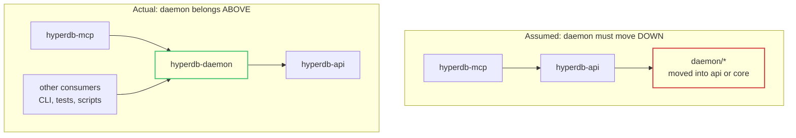

# Shared `hyperd` Daemon as a First-Class API Capability — Design Exploration

Explore promoting the resident `hyperd` daemon from an `hyperdb-mcp` internal
mechanism to a capability any `hyperdb-api` consumer can use, so that
short-lived processes stop paying `hyperd` startup cost and stop multiplying
`hyperd` instances.

**Status:** design exploration — **not approved, not decided, argue with it**
**Date:** 2026-09-06
**Author:** Stefan Steiner with Cursor (Claude Opus 5)
**Base:** `upstream/main` @ `2f31b9e`
**Branch:** `docs/shared-hyperd-daemon-design`
**Implementation plan:** [`docs/superpowers/plans/2026-09-06-shared-hyperd-daemon.md`](../plans/2026-09-06-shared-hyperd-daemon.md)

> **This document contains no code and proposes no immediate implementation.**
> It exists to be reviewed and disagreed with. Two of its conclusions are
> negative: the headline framing of the proposal is wrong in a specific and
> useful way (D1), and the most ambitious version of the feature — unrelated
> applications sharing one engine — should not be built at all (D5, D6). A
> narrower subset is worth doing, and one small piece of it has a hard deadline
> at `1.0.0` **whether or not the rest ever happens** (D2).

---

## Problem

`hyperdb-mcp` runs a resident `hyperd` that multiple MCP sessions share.
Discovery goes through `~/.hyperdb/daemon.json`, liveness through a localhost
health/control port, and the daemon detects `hyperd` crashes and restarts it.
Every *other* consumer of `hyperdb-api` — tests, examples, CLI tools, the
benchmark suite, downstream applications — spawns a private `hyperd` through
`HyperProcess::new`.

Real engineering went into that daemon, and it plausibly serves more than the
MCP. The proposal is a new mode meaning "use the shared daemon rather than
spawning your own `hyperd`", aimed at workloads that start many short-lived
processes: CLI invocations, test suites, serverless handlers, scripts.

Three things make this harder than it sounds, and they are what this document
is actually about.

**The crate graph points the wrong way.** `hyperdb-mcp` → `hyperdb-api` →
`hyperdb-api-core`. The daemon sits at the top of that stack, so
`hyperdb-api` physically cannot consume it where it lives.

**`hyperdb-api` has no feature flags, by design.** Every capability is always
available, matching the C++/Python/Java APIs
([`AGENTS.md`](../../../AGENTS.md), "Feature Flags"). So the new mode cannot be
gated, and anything added to `hyperdb-api` is paid for by every user of the
crate.

**We are at `1.0.0-rc.3`.** Public API added before `1.0.0` final is free.
After it, the surface is frozen under semver and additions cost a minor
version while removals cost a major one.

---

## Ground truth

Measured or read from the tree on 2026-09-06. Every claim below is cited
because several of them contradict the framing of the proposal.

### What already exists

- **`hyperdb-api` already connects to a `hyperd` it does not own.**
  `Connection::connect(endpoint, database_path, create_mode)`
  ([`connection.rs:247`](../../../hyperdb-api/src/connection.rs)),
  `Connection::without_database`, `ConnectionBuilder`,
  `AsyncConnection::connect`
  ([`async_connection.rs:80`](../../../hyperdb-api/src/async_connection.rs)),
  `PoolConfig { endpoint, .. }`
  ([`pool.rs:232`](../../../hyperdb-api/src/pool.rs)), `SyncPoolConfig`, and
  `grpc::GrpcConnection::connect` all take a bare endpoint and hold no
  `HyperProcess`. None of them stop `hyperd` on drop.
- **The MCP's daemon mode already uses exactly that path.**
  `Engine::try_daemon_mode` calls `Connection::connect(endpoint, …)` and stores
  `hyper: None`, so `Engine::drop` cannot stop the shared engine
  ([`engine.rs:616`](../../../hyperdb-mcp/src/engine.rs),
  [`engine.rs:2290`](../../../hyperdb-mcp/src/engine.rs)).
- **`HyperProcess` is the only thing that spawns or stops `hyperd`.** Its
  single public constructor is
  `HyperProcess::new(hyper_path: Option<&Path>, parameters: Option<&Parameters>)`
  ([`process.rs:246`](../../../hyperdb-api/src/process.rs)), and `Drop` closes
  the callback connection and waits up to 5 s
  ([`process.rs:1125`](../../../hyperdb-api/src/process.rs)).
- **`HyperProcess::drop()` is load-bearing for the test suite.**
  `TestConnection` and `TestServer` both hold a `HyperProcess` field purely so
  that scope exit reaps the server
  ([`hyperdb-api/tests/common/mod.rs:47`](../../../hyperdb-api/tests/common/mod.rs),
  [`hyperdb-api-core/tests/common/mod.rs:45`](../../../hyperdb-api-core/tests/common/mod.rs)).
  A non-stopping variant of `HyperProcess` would silently orphan a server per
  test.
- **`hyperdb-bootstrap` already sets the precedent for a library-plus-binary
  crate**: `default = ["cli"]`, `cli = ["dep:clap", "dep:anyhow", "dep:tracing-subscriber"]`
  ([`hyperdb-bootstrap/Cargo.toml:22`](../../../hyperdb-bootstrap/Cargo.toml)),
  consumable as a pure library with `default-features = false`.

### What the daemon actually is

- **Discovery** is `~/.hyperdb/daemon.json`, written temp-file-then-rename,
  carrying `pid`, `hyperd_endpoint`, `health_port`, `started_at`, `version`,
  and an optional additive `identity`
  ([`discovery.rs:22`](../../../hyperdb-mcp/src/daemon/discovery.rs)). The
  state directory is `HYPERDB_STATE_DIR` or `$HOME/.hyperdb`.
- **The control port is line-oriented TCP bound to `127.0.0.1`**
  ([`health.rs:116`](../../../hyperdb-mcp/src/daemon/health.rs)) accepting
  exactly `PING`, `HEARTBEAT`, `STOP`, `STATUS`, and `REPORT_HYPERD_ERROR`
  ([`health.rs:232`](../../../hyperdb-mcp/src/daemon/health.rs)). **There is no
  authentication of any kind.** The security model is "bound to loopback".
- **The daemon forces TCP transport** for the shared `hyperd`
  (`params.set_transport_mode(TransportMode::Tcp)`,
  [`run.rs:206`](../../../hyperdb-mcp/src/daemon/run.rs)), so the engine
  endpoint is a loopback TCP port, not a Unix socket.
- **Crash handling** polls `HyperProcess::has_exited` every 5 s and rate-limits
  to 3 restarts per 60 s, shutting down if exceeded
  ([`run.rs:55`](../../../hyperdb-mcp/src/daemon/run.rs)).
- **Idle timeout defaults to `None`** — the daemon runs forever unless
  `--idle-timeout` or `HYPERDB_DAEMON_IDLE_TIMEOUT` is set
  ([`run.rs:40`](../../../hyperdb-mcp/src/daemon/run.rs)). The 30-minute
  `DEFAULT_IDLE_TIMEOUT_SECS` is a suggestion constant, not the default.
- **There is no reference counting.** Liveness is opt-in `HEARTBEAT`, sent by
  the MCP server at most once per 60 s after a successful tool call
  ([`server.rs:1702`](../../../hyperdb-mcp/src/server.rs)). Single-instance
  enforcement is the health-port bind, not a lease count.
- **Version takeover kills the incumbent**: a client whose semver is strictly
  greater sends `STOP`, waits for the PING to fail, and respawns
  ([`spawn.rs:146`](../../../hyperdb-mcp/src/daemon/spawn.rs)).
- **`hyperdb_mcp::daemon` is public**, including `daemon::health`, exposing
  `DaemonInfo`, `HealthListener`, `DaemonState`, `send_command`,
  `report_hyperd_error_to_daemon`, `run_daemon`, `ensure_daemon`, and
  `client_should_take_over` ([`lib.rs:41`](../../../hyperdb-mcp/src/lib.rs)).

### What is MCP policy, not infrastructure

Attachment replay through `AttachRegistry`, the reserved `"persistent"` alias
and ephemeral scratch database, `_table_catalog` bootstrap, the KV store,
watched-directory pools, the doctor/diagnostics identity comparison, the
`"hyperdb-mcp"` PONG token, and the `MCP_VERSION`-driven takeover rule are all
product decisions. None belongs in a general-purpose library. The genuinely
generic residue is: the discovery file, the port scan, the control-protocol
shape, `HyperProcess` ownership with a restart limiter, and the detached-spawn
skeleton.

### Authentication and permissions, as they stand

- **The shared `hyperd` requires no credentials.** `HyperProcess` passes
  `--no-password` and `--init-user=tableau_internal_user`
  ([`process.rs:488`](../../../hyperdb-api/src/process.rs),
  [`process.rs:541`](../../../hyperdb-api/src/process.rs)) and
  `Connection::connect` hardcodes `Config::new().with_user("tableau_internal_user")`
  with no password ([`connection.rs:221`](../../../hyperdb-api/src/connection.rs)).
- **`daemon.json` is written with default umask permissions.**
  `write_discovery_record` does `fs::write` then `fs::rename` with no
  `set_permissions` ([`discovery.rs:236`](../../../hyperdb-mcp/src/daemon/discovery.rs)).
  A workspace-wide grep finds no `0o600`/`0o700` on any state file or socket
  directory. Under the common `umask 022` the file is world-readable.
- **The socket directory is not restricted either.** `create_dir_all` on
  `$TMPDIR/hyper-<pid>` with no mode
  ([`process.rs:377`](../../../hyperdb-api/src/process.rs)).
- **No hyperd threat-model document exists** in `docs/`.

### Isolation, as far as the tree proves it

- **Attach is modelled per-connection.** `attach_database`/`detach_database`
  are `Connection` methods emitting `ATTACH`/`DETACH DATABASE`
  ([`catalog.rs:115`](../../../hyperdb-api/src/catalog.rs),
  [`connection.rs:1448`](../../../hyperdb-api/src/connection.rs)), and
  `schema_search_path` is set per connection
  ([`attach.rs:52`](../../../hyperdb-mcp/src/attach.rs)).
- **But no test proves cross-session alias invisibility on one shared
  `hyperd`.** The closest evidence uses two *private* engines
  ([`attach_tests.rs:566`](../../../hyperdb-mcp/tests/attach_tests.rs)), which
  proves attach state does not survive a new process — a different claim. This
  gap is load-bearing and appears again as **Q1**.
- **`memory_limit` is a Hyper-global instance parameter**, default 80 %
  ([`hyperdb-api/tests/stress_test/README.md:169`](../../../hyperdb-api/tests/stress_test/README.md)).
  Greps for `soft_memory_limit`, `hard_memory_limit`, `admission`, and
  per-session limits find nothing. **There is no per-session resource
  isolation to configure.**
- **`Persistence::Temporary` is documented as "only available in the current
  session"** ([`table_definition.rs:11`](../../../hyperdb-api/src/table_definition.rs)).

### How production-ready the daemon is

This matters because the daemon is the asset being promoted, and the answer is
uncomfortable.

| Merged (UTC) | Commit | Change |
|---|---|---|
| 2026-09-06 18:54 | `06c5da1` | #267 daemon idle-timeout test fix |
| 2026-09-06 20:45 | `56bc0d0` | #279 test-verification gaps |
| 2026-09-06 21:57 | `61fc766` | #280 mutex poison + pool transaction leak |
| 2026-09-06 22:59 | `b54103c` | #286 (carrying #278) restart publish ordering |

The daemon has existed since 2026-05-25 and has been resident-by-default since
v0.5.0 in early June. Its `daemon/` directory then saw no functional change for
roughly three months, until #243 on 2026-08-28. **Every hardening change listed
above landed inside a single working day**, and every source issue was filed the
same day. Nine distinct concurrency or lifecycle defects were found in that
window, including a non-atomic "atomic" write, a restart publish-ordering
window, mutex poisoning that permanently bricked the MCP after any tool-call
panic, and a transaction leaking back into the connection pool.

The most consequential finding is not any single bug: **the eight
crash-and-restart tests were `#[ignore]`d unconditionally**, so the daemon
shipped resident-by-default for three months with no automated crash-recovery
coverage on any platform. #279 turned them on and CI went red immediately and
stayed red for two commits until #286.

Two daemon-shaped risks remain **open**:

- **#242** — a `hyperd` that stays alive but stops serving is never recovered.
  Reproduced by `SIGSTOP`-ing the child: a `SELECT 1` blocked for over 30 s, the
  daemon kept seeing the process as alive, and never restarted it.
- **#118** — every MCP tool call serializes behind one engine mutex held across
  the whole blocking operation, so one stalled call hangs everything including
  `status`. The issue notes this got worse when the daemon became
  resident-by-default.

The verification discipline in the recent PRs is genuinely above average — each
fix was proven red-before-green by reverting the code it guards. But this code
has **zero field exposure**, macOS CI still skips all eight restart tests, and
the Windows suite has two open flakes.

### Precedent

No document in this repository states the process model of the C++, Python, or
Java Hyper APIs, and no upstream Tableau term for a shared or attachable
`hyperd` appears anywhere in the tree. What the repo does say is that those
APIs *ship* a `hyperd` binary
([`hyperdb-mcp/README.md:123`](../../../hyperdb-mcp/README.md)) and that
`HyperProcess` defaults match "C++ `HyperProcess` behavior" in the sense of
default *parameters* ([`process.rs:483`](../../../hyperdb-api/src/process.rs)).
Connecting to an independently started server is already documented, but as a
manual step: run `hyperd` yourself and pass the endpoint
([`grpc_query.rs:25`](../../../hyperdb-api/examples/additional_examples/grpc_query.rs)).

**So a managed shared-daemon mode does appear novel relative to the sibling
APIs** — but that claim rests on absence of evidence in *this* repository, and
should be checked against upstream documentation before being used as a
differentiator in any public material. Recorded as **Q6**.

---

## Decisions

### D1 — The proposal's framing is wrong: the connect path already exists; only discovery and supervision are missing

This is the most important conclusion in the document, and it reshapes
everything after it.

"Expose a new mode meaning use the shared daemon rather than spawning your own
`hyperd`" implies `hyperdb-api` cannot currently talk to a `hyperd` it does not
own. It can, and has been able to all along. `Connection::connect` takes an
endpoint string. `PoolConfig` takes an endpoint string. The MCP's own daemon
mode is built out of those exact calls.

What is genuinely absent from `hyperdb-api` is narrower:

1. **Discovery** — turning "the shared daemon, wherever it is" into an endpoint.
2. **Supervision** — starting the daemon if absent, restarting `hyperd` when it
   dies, shutting down when idle.

Item 2 requires a **daemon process**, which requires a binary, argument
parsing, and a logging subscriber. `hyperdb-api` must not grow those, and with
no feature flags it could not gate them if it did.

The consequence is a much cheaper design than the proposal assumes, and it
inverts the assumed direction:



The daemon is a **supervisor that consumes `HyperProcess`**. It is a higher
layer than `hyperdb-api`, not a lower one. Nothing needs to move down.

- **Chosen:** treat this as "extract a supervisor crate that sits above
  `hyperdb-api`", not "promote daemon code into `hyperdb-api`".
- **Consequence:** in the minimum viable slice, **`hyperdb-api` gains no public
  API, no dependency, and nothing entering the 1.0 freeze.** That is the
  cheapest available answer and it is also the correct one.

### D2 — Extract `daemon/*` into a new `hyperdb-daemon` crate, and do it before `1.0.0` regardless of whether the rest ships

Four placements were considered.

- **Rejected — move into `hyperdb-api`.** Needs a binary, so it needs `clap`
  and a subscriber; with no feature flags every `hyperdb-api` user pays for
  them. It also puts a resident-service surface inside the 1.0 semver freeze
  and inside the crate whose job is to mirror the sibling Hyper APIs.
- **Rejected — move into `hyperdb-api-core`.** Worse. `hyperdb-api-core` is
  positioned as forever-internal and sits *below* the API; supervision is
  strictly above wire protocol. This inverts the layering the architecture
  documents.
- **Rejected — one crate that `hyperdb-api` depends on.** Makes discovery a
  mandatory transitive dependency for every `hyperdb-api` user, most of whom
  will never use it, with no flag available to opt out.
- **Chosen — a new `hyperdb-daemon` crate that depends on `hyperdb-api`**,
  shipping a client library plus a `hyperdb-daemon` binary behind a
  `default = ["cli"]` feature, exactly mirroring `hyperdb-bootstrap`.
  `hyperdb-mcp` then depends on `hyperdb-daemon` and deletes its own
  `daemon/*`. Dependency direction is `hyperdb-daemon → hyperdb-api`, the same
  direction `hyperdb-mcp → hyperdb-api` already goes, so no layering rule
  bends.

**This decision answers open issue #276 directly.** That issue asks whether
`hyperdb_mcp::daemon::health` should be public at all before 1.0, having
observed that `report_hyperd_error_to_daemon` changed signature in a patch
release with no breaking-change entry. The answer this design gives: **no.**
The module is public by accident of module organisation, not by intent —
nothing about running an MCP server requires callers to reach into its daemon
control protocol. The surface belongs to a crate whose stated job is exactly
that, where it can carry its own compatibility promise.

And it carries a real deadline. `pub mod daemon` in `hyperdb-mcp` is a public
surface today. Removing it after `1.0.0` is a major version. Removing it before
`1.0.0` is free. **So the extraction is worth doing on issue #276's merits
alone, even if every later phase in this document is rejected.** It is also the
cheapest phase, being a move plus a re-export.

- **Chosen:** extract before `1.0.0`; treat it as a `refactor:`/`fix:` change
  that narrows `hyperdb-mcp`'s public surface, independent of the shared-mode
  feature.

### D3 — Everything else lands after `1.0.0`

Once D1 holds, the pre-1.0 pressure almost entirely evaporates. The shared-mode
API lives in a new crate, which starts at `0.1.0` and can iterate freely
regardless of what the workspace's flagship crate is doing.

Exactly one candidate `hyperdb-api` change has a pre-1.0 deadline, and it is
small: **whether `Connection::new` should keep taking a concrete
`&HyperProcess`.**

```rust
// today
pub fn new(instance: &HyperProcess, database_path: impl AsRef<Path>, create_mode: CreateMode) -> Result<Self>
```

If a shared-engine handle should ever be usable where a `HyperProcess` is
usable, that parameter needs to become a trait bound. Generalising a concrete
parameter to `impl Trait` is source-compatible for ordinary call sites but not
for turbofish or function-pointer uses, so it is cheapest to do — or decide
against — before the freeze.

- **Chosen:** do **not** generalise it now. `Connection::connect(endpoint, …)`
  already covers the shared case, and adding a trait purely for symmetry is
  speculative generality. Adding the trait later is a *minor* addition, since a
  new trait plus a new inherent method breaks nothing.
- **Recorded as the one pre-1.0 API decision a human should confirm**
  (**Q5**), because if the answer is "yes, symmetry matters", the window closes
  at `1.0.0`.
- **Rejected — ship the shared-mode API before `1.0.0` to get it in free.**
  The security floor (D6) is not met, the benefit is unmeasured (D9), and #242
  is open. Rushing an unproven resident-service API into a frozen surface to
  save a minor version is a bad trade.

### D4 — Default to *cohort-scoped* daemons, not one machine-wide daemon

This is the design's answer to the isolation problem, and it is the difference
between a feature that is safe and one that is not.

The MCP model is one daemon per user, machine-wide. Generalising *that* to a
library means unrelated applications share an engine, which is where every hard
problem in this document comes from. But re-read where the benefit actually is:
a test suite spawning hundreds of servers, a CLI invoked repeatedly in a loop,
a warm pool of serverless handlers running the same code. **In every one of
those, the processes sharing the daemon are the same application, the same
build, and the same trust domain.**

So do not multi-tenant. Key the daemon on a **cohort**: a caller-supplied
identifier, defaulting to something derived from the calling application rather
than to a global constant. Different cohorts get different daemons, different
`hyperd` processes, and therefore complete isolation — while still getting the
warm-start sharing that motivated the whole idea.

```text
~/.hyperdb/
  daemons/
    <cohort-hash>/
      daemon.json        0600
      logs/
```

What this buys:

- The multi-tenancy question (D5) stops being a blocker and becomes a
  documented boundary: sharing happens only within a cohort you named.
- The global `memory_limit` problem stops being cross-application.
- Blast radius is scoped to one application's own processes.
- Version skew mostly disappears, because a cohort is usually one build.

What it costs: a machine running five cohorts runs five `hyperd` processes,
which is worse than one and better than one-per-process. That is the right
place on the curve, and it is honest about not being free.

- **Chosen:** cohort-scoped by default; a machine-wide cohort is expressible but
  must be opted into explicitly and documented with the D5/D6 caveats.
- **Rejected — one global daemon per user (the MCP model).** Correct for a
  single-user developer tool with one product's policy. Not defensible as a
  library default; see D5.

### D5 — Cross-application sharing is not safely offerable, and the reason is not fixable in this repository

Working through what two unrelated applications on one `hyperd` actually see:

| Resource | Scope | Leaks across tenants? |
|---|---|---|
| `ATTACH DATABASE` alias | Per connection | Probably not — **unproven**, see **Q1** |
| `CREATE TEMPORARY TABLE` | Per session | No |
| `schema_search_path`, `SET` | Per connection | No |
| Prepared statements | Per connection | No (by protocol usage) |
| `.hyper` file contents | Per file | **Yes** — anyone who attaches it sees it |
| `memory_limit` | **Instance-global** | **Yes, unavoidably** |
| Threads, admission control | Instance-global | **Yes** — no per-session quota exists |
| `hyperd` process liveness | Instance-global | **Yes** — one crash hits every tenant |
| MCP `_table_catalog` | Per persistent file | Yes, if the path is shared |

The SQL namespace is probably fine. The **resources are not**, and that is the
disqualifying finding: `memory_limit` is a Hyper instance parameter with no
per-session equivalent anywhere in the tree. One tenant's oversized query
applies memory pressure to every other tenant on the instance, and there is no
knob to prevent it because Hyper does not expose one. This is not a gap in the
daemon; it is a property of the engine.

Blast radius compounds it. When the shared `hyperd` dies, every tenant loses
in-flight transactions *and* every session's attach state. The daemon restarts
`hyperd` — but attachment replay is MCP policy living in `AttachRegistry`, so a
library client would simply find its attachments silently gone against a
freshly restarted engine. Rebuilding session state after a peer-induced restart
is a burden the library would be pushing onto every caller.

- **Chosen:** define the safe boundary precisely and refuse to cross it.
  Sharing is supported **only** when all participants are the same OS user, the
  same trust domain, and the same cohort, and when callers accept that a peer
  can consume engine memory and can take the engine down. Documented as a
  hard contract, not a footnote.
- **Rejected — offer general cross-application sharing with caveats.** The
  caveat would have to say "an unrelated application can exhaust your memory
  budget and kill your engine, and you must rebuild your session state when it
  does". A library feature whose honest documentation reads like that should not
  ship.

### D6 — The security floor is not met today, and control-port authentication alone would be theater

Threat model. Assets: `.hyper` files readable and writable by the daemon's UID,
and the availability of the shared engine. Actors: other local UIDs on a
multi-user workstation or shared CI runner, and other processes under the same
UID.

Three live weaknesses, all confirmed above:

1. **The engine endpoint requires no credentials.** `hyperd` runs with
   `--no-password` and a well-known `--init-user`. Anyone who can open the
   loopback TCP port connects as `tableau_internal_user` and can then
   `ATTACH DATABASE '<any path the daemon UID can read>'`.
2. **`daemon.json` publishes that endpoint world-readably**, because nothing
   chmods it and the common umask is `022`.
3. **The control port authenticates nothing.** Any local process can `STOP` the
   daemon, or send `REPORT_HYPERD_ERROR` three times in 60 s to trip
   `RESTART_LIMIT` and make it shut itself down.

Chain 1 and 2 and it is a **confused-deputy privilege escalation**: a different
local UID reads the discovery file, connects with no password, and borrows the
daemon owner's filesystem authority over `.hyper` files. For a single-user
developer tool this is a thin risk with a short window. As a general library
capability it becomes a standing, always-on, machine-wide service, which is a
materially different proposition — and CI runners are the worst case, being
multi-tenant with a resident daemon that can outlive the job.

The important part: **fixing the control port does not fix this.** The control
port is not the interesting attack surface; the `--no-password` engine endpoint
is. Adding a token to `STOP` while leaving the engine open to anyone who can
read a world-readable file would be security theater.

Minimum floor before any third-party-facing shared mode:

- **Move the shared engine to Unix domain sockets** in a `0700` directory with a
  `0600` socket, and to a named pipe with an explicit DACL on Windows, so peer
  identity is enforced by the OS rather than assumed from "loopback".
- **Create `~/.hyperdb` at `0700` and write `daemon.json` at `0600`**, setting
  the mode before the content lands, so file permission becomes the
  authorization mechanism.
- **Require a capability token** — generated per daemon, stored in the
  now-`0600` discovery file — on every state-changing control command. `PING`
  and `STATUS` may stay open; `STOP` and `REPORT_HYPERD_ERROR` must not.
- **Decide the engine-credential question explicitly** (**Q2**): either give
  the shared `hyperd` a generated password, or document plainly that anyone who
  can reach the endpoint has full authority over it. Both are defensible. Not
  deciding is not.
- **If TCP must be kept**, verify peer UID via `SO_PEERCRED`/`LOCAL_PEERCRED`.

Note that the daemon currently *forces* TCP
([`run.rs:206`](../../../hyperdb-mcp/src/daemon/run.rs)) and that the UDS path
in `HyperProcess` is not the runtime default either
([`process.rs:362`](../../../hyperdb-api/src/process.rs), which defaults to
`Tcp` "until UDS performance is validated" despite `TransportMode`'s
`#[default]` being `Ipc`). So the first bullet is not a config change; it needs
that validation done first.

- **Chosen:** treat the floor as a hard gate. No shared mode is offered to
  third parties until UDS/named-pipe transport, restrictive permissions, and
  token-gated destructive commands are all in place and the engine-credential
  question is answered.

### D7 — Lease-based lifecycle, and libraries must never take over

**Who starts it.** Any client, on demand, via detached spawn — the existing
`ensure_daemon` shape.

**Who stops it.** Nobody explicitly. Idle timeout, and it must be **on by
default** for a library-acquired daemon. Today's `None` default is right for a
product that wants to stay warm for its user and wrong for a library: a
`cargo test` run must not leave a resident service behind. A conservative
default in the minutes, explicitly overridable, is the shape.

**Reference counting versus idle timeout.** Today there is no refcount, and
pure heartbeat-based idling has a real failure mode: a client that is alive but
idle past the timeout has the engine shut down underneath it. Recommend a
**lease**: clients register on acquire and release on drop, the daemon tracks
lease count, and the idle timer only runs while the count is zero. Heartbeats
remain as the liveness mechanism that expires leases held by processes that died
without releasing. This needs new control commands, hence a control-protocol
version (D8).

**Crash recovery.** Keep the existing 5-second poll and the 3-per-60-seconds
limiter, but note that **#242 is a prerequisite, not a nice-to-have**: a
`hyperd` that is alive but wedged is currently never recovered, and a >30 s
unrecoverable hang is a much worse experience for a library caller who never
opted into a resident service than for an MCP user who can restart their
client.

**Version skew and the upgrade case.** The current rule — client with strictly
greater semver sends `STOP` and respawns — is actively dangerous when
generalised. Application A on v1.2 would kill the daemon that application B on
v1.1 is mid-transaction against. For a library:

- **Libraries never take over.** If the resident daemon speaks a compatible
  control protocol, use it as-is even if older.
- If it does not, **start a second daemon in a distinct cohort** rather than
  killing the incumbent.
- Deliberate takeover stays available as an explicit operator action in the
  CLI, where a human is choosing to do it.

### D8 — Version the control protocol separately from the crate

Crate semver is the wrong compatibility axis for a wire protocol, and #276 is
the evidence: `report_hyperd_error_to_daemon` changed signature under a
compatible-looking patch bump, and `send_command_with_timeout` silently
redefined `read_timeout` from per-read to whole-exchange with no signature
change at all.

Add an explicit `protocol` integer to `daemon.json` and to the `PING` response.
The promise: **a client supports protocol N and N-1**; a daemon advertising an
unsupported protocol is treated as absent rather than as an error, and the
client starts its own cohort daemon. That is a checkable contract, expressible
independently of whatever `hyperdb-daemon`'s crate version happens to be.

Forward compatibility is already partly right — `daemon.json` has no
`deny_unknown_fields`, so unknown keys are ignored, and #278 fixed the reader
half that was violating that contract. Keep that, and add the explicit integer
so skew is detectable rather than inferred.

### D9 — Do not build this until the benefit is measured

The entire premise is that sharing saves startup cost. **This repository does
not contain a measurement of `hyperd` spawn-to-usable wall clock.** See the
quantification section: the honest state is one figure from an adjacent code
path, one CI upper bound, and a set of timeouts.

That is not a reason to abandon the idea. It is a reason not to design against
a number nobody has. A bounded measurement is cheap — it is a loop around
`HyperProcess::new` plus a trivial query — and it should gate the work, because
the answer changes the design:

- If cold spawn is ~150 ms, the warm win per process is ~150 ms, and this is
  worth doing only for workloads that pay it hundreds of times.
- If cold spawn is seconds on the platforms people actually use, the win is
  large and the feature is clearly justified.
- If cold spawn is *cheaper* than the daemon's own cold-acquisition path, the
  feature is net-negative for the first process and only ever wins on the
  second — which is still fine, but changes what the default should be.

Issue #270 shows the third case is not hypothetical: a skewed discovery record
made the client wait out the 10-second `SPAWN_TIMEOUT` and then spawn a private
`hyperd` anyway. Cold-path acquisition cost is a first-class design constraint,
which is why D10 puts a deadline on it.

### D10 — Three explicit intents, no silent fallback, and a hard deadline on the cold path

Callers have three genuinely different intentions and must be able to say which.

```rust
/// How to obtain a `hyperd` to talk to.
pub enum Acquisition {
    /// Spawn a private `hyperd`. Today's behaviour; remains the default.
    Private,
    /// Use the shared cohort daemon. Fail if it cannot be reached or started.
    Shared,
    /// Prefer the shared cohort daemon; fall back to a private `hyperd`.
    /// Never slower than `Private` by more than `fallback_deadline`.
    SharedOrPrivate,
}
```

`SharedOrPrivate` must carry a **deadline**, and this is not a tuning knob but
the fix for the #270 shape. If discovery and spawn have not produced a usable
endpoint within a budget smaller than the measured private-spawn cost, abandon
and spawn private. That makes the preferring mode *provably* not a pessimisation
— the property #270's ten-second stall violated.

**Fallback must be observable.** The MCP currently logs it at `debug` and
returns `Ok(None)` ([`engine.rs:604`](../../../hyperdb-mcp/src/engine.rs)),
which is exactly why #270 was invisible in normal operation. For a library:

- `Shared` returns a **typed error** naming why (no daemon, spawn timed out,
  protocol too old, token rejected).
- `SharedOrPrivate` succeeds, but the handle reports which mode it got **and**
  why the preferred one was declined, and it logs at `warn`, not `debug`.
- The default stays `Private`, so existing behaviour is untouched and sharing
  is always something a caller asked for.

### D11 — The proposed API

Concrete, additive, and living in `hyperdb-daemon`. Note that the connect calls
are today's unmodified `hyperdb-api` calls.

```rust
// ---- hyperdb-daemon ----

/// A `hyperd` obtained by either route. Knows whether it owns the process.
pub enum Engine {
    Private(hyperdb_api::HyperProcess),
    Shared(SharedEngine),
}

impl Engine {
    /// libpq endpoint, usable with every `hyperdb-api` connect API.
    pub fn endpoint(&self) -> &str;
    pub fn connection_endpoint(&self) -> &ConnectionEndpoint;
    pub fn acquired(&self) -> Acquired;             // Private | Shared
    /// Why `Shared` was declined, when `SharedOrPrivate` fell back.
    pub fn fallback_reason(&self) -> Option<&FallbackReason>;
}

/// Drop releases the lease and stops heartbeating.
/// It does NOT stop `hyperd` — that asymmetry with `HyperProcess::drop` is
/// the whole point and is the invariant most worth testing.
pub struct SharedEngine { /* … */ }

impl SharedEngine {
    pub fn endpoint(&self) -> &str;
    pub fn daemon_pid(&self) -> u32;
    pub fn protocol_version(&self) -> u32;
    pub fn cohort(&self) -> &Cohort;
}

#[non_exhaustive]
#[derive(Clone, Debug)]
pub struct Options {
    pub cohort: Cohort,
    pub state_dir: Option<PathBuf>,
    pub idle_timeout: Option<Duration>,     // Some(_) by default — see D7
    pub fallback_deadline: Duration,        // see D10
    pub hyperd_path: Option<PathBuf>,
    pub parameters: Option<Parameters>,     // applied only when we start it
}

pub fn acquire(how: Acquisition, options: &Options) -> Result<Engine>;
pub async fn acquire_async(how: Acquisition, options: &Options) -> Result<Engine>;
```

`Options` is `#[non_exhaustive]` deliberately: `ChartOptions` in `hyperdb-mcp`
was found to be source-breaking to extend precisely because it was not, and
this crate will grow knobs.

**Sync, before and after.** The `Connection::new` line changes to
`Connection::connect`; nothing else moves.

```rust
// today
let hyper = HyperProcess::new(None, None)?;
let conn = Connection::new(&hyper, "db.hyper", CreateMode::CreateIfNotExists)?;

// shared, or private if the daemon is unavailable
let engine = hyperdb_daemon::acquire(
    Acquisition::SharedOrPrivate,
    &Options::for_cohort("my-cli"),
)?;
let conn = Connection::connect(engine.endpoint(), "db.hyper", CreateMode::CreateIfNotExists)?;
if engine.acquired() == Acquired::Private {
    tracing::warn!(reason = ?engine.fallback_reason(), "shared engine unavailable");
}
```

**Async, before and after.** Note there is no `AsyncConnection` constructor
taking a `HyperProcess` today, so async callers *already* pass an endpoint
string — for them this is purely a change of where the string comes from.

```rust
// today
let hyper = HyperProcess::new(None, None)?;
let conn = AsyncConnection::connect(hyper.require_endpoint()?, "db.hyper", mode).await?;

// shared, required
let engine = hyperdb_daemon::acquire_async(Acquisition::Shared, &opts).await?;
let conn = AsyncConnection::connect(engine.endpoint(), "db.hyper", mode).await?;

// and the pool needs no change at all
let pool = create_pool(PoolConfig::new(engine.endpoint(), "db.hyper"))?;
```

The pool example is the clearest illustration of D1: connection pooling over a
shared daemon works today, with no new API, because `PoolConfig.endpoint` is
already a string and the pool has never owned a process.

---

## Quantified benefit

Labelled honestly. **Two figures are read from the tree; everything else is an
estimate or an explicit gap.** No benchmark was run for this document — another
worker was building concurrently and disk has been tight — so the numbers below
are exactly as strong as their citations and no stronger.

### `hyperd` startup cost — the primary claimed win, and it is not measured

| Figure | What it measured | Hardware | Source | Confidence |
|---|---|---|---|---|
| **~156 ms** | First embedded Hyper start in a proc-macro host | **not stated** | [`hyperdb-api-derive/README.md:216`](../../../hyperdb-api-derive/README.md) | **read from tree**, adjacent path |
| **~7 ms** | One `LIMIT 0` dry-run on an already-warm connection | not stated | [`hyperdb-compile-check/src/db.rs:28`](../../../hyperdb-compile-check/src/db.rs) | **read from tree** |
| **"10+ seconds under load"** | CI upper bound, `hyperd` startup alone | CI runners, "especially macOS" | [`daemon_tests.rs:1775`](../../../hyperdb-mcp/tests/daemon_tests.rs) | **read from tree**, upper bound only |
| "20 ms vs 10 s" | An unresolved prior conflict a spike was meant to settle | — | [`phase0_compile_check_spike.rs:10`](../../../hyperdb-api/tests/phase0_compile_check_spike.rs) | **never recorded** |

`docs/BENCHMARK_GUIDE.md` and `docs/hyperd-release-benchmarks.md` were both
checked first, as instructed. **Neither publishes a spawn-to-usable wall
clock** — they measure throughput, and `hyperd-release-benchmarks.md`'s
"cold-start variance" refers to insert-throughput variance, not process spawn.
The Phase-0 spike prints elapsed times under `--nocapture` but is `#[ignore]`d
and asserts nothing about duration.

Relevant timeouts bound the space without measuring it:
`HyperProcess::wait_for_callback` polls up to **60 s**
([`process.rs:709`](../../../hyperdb-api/src/process.rs) — note the doc comment
at `:226` says 30 s and is wrong), and the daemon's client-side
`SPAWN_TIMEOUT` is **10 s** ([`spawn.rs:18`](../../../hyperdb-mcp/src/daemon/spawn.rs)).

**How to measure it, so this gap closes cheaply.** Time `HyperProcess::new`
plus one trivial query to first row, 20 iterations, median and p95, release
build, on macOS and Linux, warm page cache and cold. Then time
`hyperdb_daemon::acquire(Shared, …)` plus the same query against an
already-running daemon. The delta between those two medians *is* the per-process
win, and the second number is the one the design actually needs, because
discovery is not free either: a warm `discover()` is roughly a file read plus
one PING (**~1 ms** per
[`server.rs:1737`](../../../hyperdb-mcp/src/server.rs)), but a dead port costs a
**300 ms** timeout and a full 16-port scan can reach **4.8 s**.

### Memory footprint of one `hyperd` versus N

**Not measured anywhere in the repository.** Greps for RSS and footprint
figures find only benchmark-host RAM totals (96 GB, 127.8 GB) and the
qualitative claim that the shared daemon gives "reduced memory overhead"
([`hyperdb-mcp/README.md:36`](../../../hyperdb-mcp/README.md)).

This is a real gap, and it interacts with D5: `memory_limit` defaults to **80 %
of host RAM** and is instance-global. So N private `hyperd` processes each
believe they may use 80 % of the machine — which is an argument *for* sharing on
memory grounds that nobody has quantified, and simultaneously the mechanism by
which one shared tenant starves another. Measuring idle and post-query RSS for
one process is a `ps`-in-a-loop exercise and should be done in the same pass as
startup.

### What sharing costs

Here the repository does have data, and it is more nuanced than "sharing is
free". From `docs/BENCHMARK_GUIDE.md` — Apple M3 Max, 96 GB, `hyperd`
`0.0.26479`, 2026-09-05, medians of 5:

| Workload | 1 connection | 4 connections | Direction |
|---|---|---|---|
| `AsyncArrowInserter`, 100M rows | **68.90 M/s** | **48.47 M/s** | **30 % worse** |
| `query.full_scan`, async | 24.91 M/s | **73.45 M/s** | ~2× better |
| `query.filtered`, async | 26.90 M/s | 48.31 M/s | better |

The guide states plainly that **"parallelism no longer helps Arrow inserts"**
and that single-connection `AsyncArrowInserter` outruns the 4-connection
variant, "so spending connections on an Arrow insert buys nothing on this host"
([`BENCHMARK_GUIDE.md:201`](../../../docs/BENCHMARK_GUIDE.md)). It also warns
that the ×4 rows are "order-of-magnitude only", with a ±20–61 % spread, because
four workers contend on a 14-core laptop
([`BENCHMARK_GUIDE.md:190`](../../../docs/BENCHMARK_GUIDE.md)).

Read for this design: **one `hyperd` serves concurrent readers well and
concurrent bulk writers poorly.** A shared daemon whose tenants are all
ingesting will contend on exactly the workload where extra connections already
measure negative. Note the Windows figures invert this (5.39 → 20.28 M/s for
×4), so the conclusion is host- and engine-version-specific, not universal.

Beyond throughput, sharing costs: blast radius (one crash hits every tenant,
and attach state does not survive it), the unbounded `memory_limit` interaction,
and #118's serialization if a shared daemon ever grows a single-lock front end.

### Where this wins, where it is neutral, and where it is worse

| Workload shape | Verdict | Why |
|---|---|---|
| Test suite, hundreds of sequential server starts | **Clear win** | Pays spawn cost most often; single trust domain; ~245 helper-backed spawn sites exist today against a ~121 s `make test` |
| CLI invoked repeatedly in a loop or script | **Clear win** | Per-invocation spawn dominates a short workload |
| Serverless warm pool, same function | **Likely win** | Many short processes, one trust domain — but only if the daemon survives between invocations, which is platform-dependent |
| Long-running server, one process | **Neutral to negative** | Spawn paid once; adds a discovery dependency, a second failure domain, and a peer that can take the engine down |
| Concurrent bulk ingest from several processes | **Actively worse** | ×4 Arrow insert already measures 30 % *below* single-connection on the benchmark host |
| Unrelated applications, mixed trust | **Do not** | D5 and D6 |

**The win is narrower than the proposal implies.** It is concentrated in
many-short-processes-same-application, which is real and worth serving, and it
is absent or negative for the single long-lived process that most library users
actually are.

---

## Non-goals

- **No remote or network daemon.** Loopback and local IPC only. This is not a
  `hyperd` broker.
- **No multi-user daemon.** One daemon per `(uid, cohort)`. Never a service
  shared across OS users.
- **No cross-trust-domain multi-tenancy.** D5.
- **No attachment replay, catalog, KV store, doctor, or watched directories.**
  MCP policy stays in `hyperdb-mcp`.
- **No replacement for `HyperProcess`.** `Private` remains the default and
  `HyperProcess::drop` keeps stopping the process, because the test suite
  depends on it.
- **No non-stopping variant of `HyperProcess`.** A `HyperProcess` that skips
  shutdown on drop would break the dead-man's-switch contract and orphan a
  server per test helper. Shared handles are a distinct type.
- **No feature flag on `hyperdb-api`.** Firm repository constraint; the design
  satisfies it by adding nothing to `hyperdb-api` at all.
- **No fix for #242 or #118 as part of this work** — but #242 is named a
  **prerequisite gate**, not a follow-on.
- **No changes to release automation, crate versions, or the root changelog.**
- **No claim about the C++/Python/Java process model** beyond what this
  repository documents. See **Q6**.

---

## Blockers and prerequisites

- **P1 — #242, a wedged-but-live `hyperd` is never recovered.** Reproduced at
  >30 s. Acceptable for a tool a developer can restart; not acceptable for a
  library that silently enrolled the caller in a resident service. **Gate.**
- **P2 — the security floor of D6.** UDS/named-pipe transport with enforced
  permissions, `0600` discovery file, token-gated destructive commands, and an
  answer to the engine-credential question. **Gate for any third-party-facing
  mode.**
- **P3 — UDS performance is unvalidated.** `HyperProcess` defaults to TCP
  explicitly "until UDS performance is validated"
  ([`process.rs:362`](../../../hyperdb-api/src/process.rs)) and the daemon
  forces TCP. D6's first bullet cannot land until that validation happens.
- **P4 — the benefit is unmeasured.** D9. **Gate.**
- **P5 — macOS CI skips all eight daemon restart tests**, and the Windows suite
  has two open flakes (#288, #268). Promoting the daemon to a library capability
  while its crash-recovery tests run on one platform is not defensible.
- **P6 — the daemon has zero field exposure.** Its newest fix merged the same
  day as the release PR. This is an argument for elapsed time, not more code.

---

## Open questions

Each needs a human decision or an experiment. None should be resolved by
argument alone.

- **Q1 — Does a session on a shared `hyperd` see another session's attached
  databases?** The API models attach per-connection and the MCP's own registry
  is per-process, but **no test proves cross-session invisibility on one
  shared instance**; the closest evidence uses two private engines, which
  proves something else. *Needs an experiment*: two connections to one
  `hyperd`, A attaches a file with an alias, B queries that alias and also
  enumerates `pg_catalog.pg_database`. If B can see it, the isolation model in
  D5 is weaker than assumed and cohort scoping (D4) moves from
  strongly-recommended to mandatory.
- **Q2 — Should the shared `hyperd` require credentials?** Generated password
  in the `0600` discovery file, versus documenting that endpoint reachability
  equals full authority. *Needs a decision*, because D6's floor is incomplete
  without it and the choice determines whether UDS permissions are the whole
  authorization story or merely part of it.
- **Q3 — Lease refcounting, or heartbeat-only idle?** Leases avoid shutting the
  engine out from under an idle-but-live client, at the cost of new control
  commands and a protocol bump. *Needs a decision* on whether that complexity
  is warranted for the first release, or whether a generous idle timeout plus
  heartbeats is enough.
- **Q4 — What is the default cohort?** Derived from the executable path? The
  crate name? A required explicit argument with no default? A path-derived
  default silently splits cohorts when a binary is rebuilt to a different
  location; a required argument is more honest but less ergonomic. *Needs a
  decision.*
- **Q5 — Should `Connection::new` be generalised from `&HyperProcess` to a
  trait before `1.0.0`?** D3 recommends no. This is the **only** identified
  `hyperdb-api` change whose cost rises after the freeze, so it needs an
  explicit human confirmation rather than a default. *Deadline: `1.0.0`.*
- **Q6 — Do the C++/Python/Java Hyper APIs, or upstream Hyper itself, already
  have a shared-instance concept?** Nothing in this repository describes one,
  but that is absence of evidence. *Needs external verification* against
  upstream documentation before "novel" is claimed publicly, and terminology
  should be aligned rather than invented if a concept already exists.
- **Q7 — Should `hyperdb-mcp` keep its takeover behaviour after extraction?**
  D7 says libraries must never take over, but the MCP's binary-upgrade UX
  currently depends on it. *Needs a decision* on whether takeover becomes a
  CLI-only operator action, and what the MCP's upgrade path looks like if so.

---

## Recommendation

**Do a narrow subset. Do the extraction now; gate everything else.**

1. **Extract `daemon/*` into `hyperdb-daemon` before `1.0.0`.** Worth doing on
   issue #276's merits alone, independent of this feature, and the window
   closes at the freeze. Cheapest phase; answers a standing open question.
2. **Measure startup cost and `hyperd` RSS.** Cheap, and it gates whether any
   of the rest is justified.
3. **Fix the security floor and #242** before offering anything to third
   parties.
4. **Then, if the measurement holds, ship cohort-scoped `acquire()`** as a
   `0.1.0` of the new crate, after `1.0.0`, with `Private` as the default and no
   silent fallback.
5. **Do not build cross-application sharing.** The instance-global
   `memory_limit`, the shared blast radius, and the `--no-password` endpoint
   make it indefensible, and none of the three is fixable in this repository.

The parts that should **stay** in `hyperdb-mcp` are all of the policy:
attachment replay, the persistent/ephemeral database model, the catalog, the KV
store, watched directories, the doctor, and the product's own version-takeover
UX.

What the user's proposal gets right is that substantial engineering went into
this daemon and it is under-leveraged. What it gets wrong is the direction: the
daemon does not need to descend into `hyperdb-api`, because the connect path is
already there. It needs to be lifted out of `hyperdb-mcp` into a crate of its
own — which is a smaller, cheaper, and more useful change than the one
proposed, and it is the one with an actual deadline.
