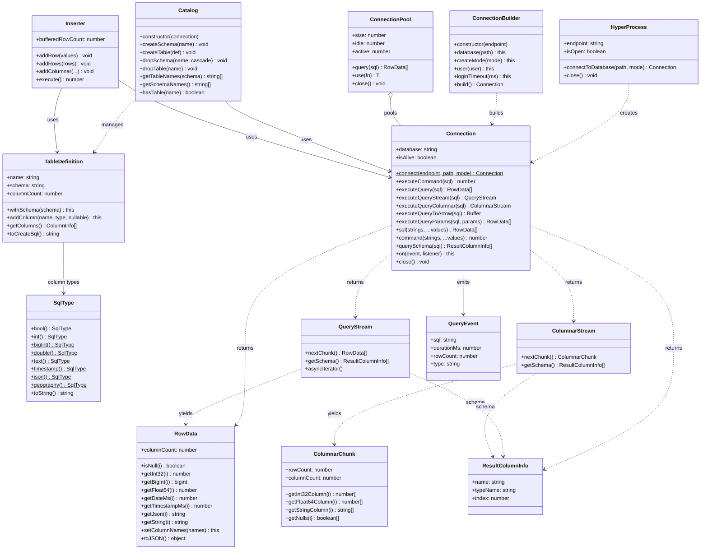

# Development Guide — hyperdb-api-node

This document covers building, testing, publishing, and contributing to the
`hyperdb-api-node` package. For the user-facing API reference and usage guide,
see [README.md](README.md).


## Architecture

`hyperdb-api-node` is a three-layer stack: pure-JS extensions on top of napi-rs
bindings on top of the Rust `hyperdb-api` crate.

```
┌───────────────────────────────────────────────────────┐
│  JS extensions                                        │
│  index.js   — native loader + tagged templates,       │
│               parameterized queries, event hooks,     │
│               Symbol.asyncDispose, RowData.toJSON     │
│  pool.mjs   — ConnectionPool (pure JS)                │
│  arrow.mjs  — Arrow convenience helpers (pure JS)     │
├───────────────────────────────────────────────────────┤
│  napi-rs bindings (Rust → JS bridge)                  │
│  src/*.rs   — #[napi] structs and methods             │
│               compiles to .node shared library         │
├───────────────────────────────────────────────────────┤
│  hyperdb-api — Pure Rust high-level API                │
│  hyperdb-api-core::client — TCP/gRPC, PostgreSQL wire protocol    │
└───────────────────────────────────────────────────────┘
```

**Key architecture decisions:**

- **Sync Rust, async JS.** The Rust `Connection` is synchronous internally.
  Each async JS method runs the blocking Rust code on a `tokio::task::spawn_blocking`
  thread pool, returning a Promise to JavaScript.
- **Thread safety.** Connections are wrapped in `Arc<Mutex<...>>` for safe
  concurrent access from the JS event loop.
- **Eager result collection.** `executeQuery()` collects all rows into memory
  before returning. For large result sets, use streaming or Arrow APIs.


## Class Diagram




## Module Map

### Rust source (`src/`)

| File | Purpose |
|------|---------|
| `lib.rs` | Module declarations |
| `connection.rs` | `Connection`, `ConnectionBuilder` — napi-rs bindings |
| `process.rs` | `HyperProcess` — manages the `hyperd` server process |
| `inserter.rs` | `Inserter` — COPY protocol bulk inserts |
| `catalog.rs` | `Catalog` — DDL operations (create/drop tables/schemas) |
| `result.rs` | `RowData`, `ResultColumnInfo` — query result types |
| `query_stream.rs` | `QueryStream` — streaming row-oriented results |
| `columnar.rs` | `ColumnarStream`, `ColumnarChunk` — columnar results |
| `types.rs` | `SqlType`, `TableDefinition`, `CreateMode` |
| `query_stats.rs` | Query statistics tracking |

### JavaScript / TypeScript

| File | Purpose |
|------|---------|
| `index.js` | Native binding loader + all JS extensions (see below) |
| `index.d.ts` | Hand-written TypeScript declarations (full IntelliSense) |
| `pool.mjs` | `ConnectionPool` — pure JS connection pooling |
| `arrow.mjs` | Arrow convenience helpers (`tableFromQuery`, `insertFromTable`, etc.) |

### Build infrastructure

| File | Purpose |
|------|---------|
| `Cargo.toml` | Rust crate config (`cdylib`, depends on `hyperdb-api` + `hyperdb-api-core`) |
| `build.rs` | Rust build script |
| `package.json` | npm package config, build scripts, napi platform triples |
| `scripts/copy-node.js` | Copies build artifact to project root with platform-specific name |
| `scripts/ci-copy-artifact.js` | CI artifact handling |
| `npm/` | Platform package scaffolding (one directory per target triple) |

### Tests and examples

| File | Purpose |
|------|---------|
| `__test__/smoke.mjs` | Smoke tests covering all major features |
| `__test__/benchmark.mjs` | Insert and query performance benchmarks |
| `examples/complete-api-tour.mts` | Full TypeScript API tour (19 sections) |
| `examples/complete-api-tour.mjs` | Same tour in plain JavaScript |
| `examples/typed-analytics.mts` | TypeScript analytics pipeline |
| `examples/arrow-analytics.mjs` | Arrow integration deep-dive |
| `examples/generate-demo-data.mjs` | Demo data generator |
| `examples/hyper-explorer/` | Web-based database inspector (React + Express) |


## Building from Source

### Prerequisites

1. **Rust toolchain** — install via [rustup](https://rustup.rs/)
2. **Node.js** >= 21
3. **npm** >= 9
4. **`hyperd` binary** — set `HYPERD_PATH` environment variable

### Build steps

```bash
cd hyperdb-api-node

# Install JS dependencies (includes @napi-rs/cli)
npm install

# Build native addon (debug — fast compile, slow runtime)
npm run build:debug

# Build native addon (release — slow compile, fast runtime)
npm run build
```

### What `npm run build` does

1. `cargo build -p hyperdb-api-node --release` — compiles the Rust crate to a
   `.node` shared library
2. `node scripts/copy-node.js release` — copies the build artifact to the
   project root with the platform-specific name (e.g.,
   `hyperdb-api-node.darwin-arm64.node`)

### Debug vs. release

| Mode | Command | Compile time | Runtime speed | Use for |
|------|---------|-------------|---------------|---------|
| Debug | `npm run build:debug` | Fast | ~10x slower | Development, testing |
| Release | `npm run build` | Slow | Full speed | Benchmarks, production |

Always build in release mode before running benchmarks.


## Running Tests

```bash
# Requires HYPERD_PATH to be set
npm test
```

Tests use Node.js built-in `assert` module (no external test framework).
The smoke test (`__test__/smoke.mjs`) covers: connections, queries, inserts,
streams, columnar, pool, tagged templates, parameterized queries, BigInt,
dates, JSON, event hooks, and resource disposal.

Test artifacts are written to `test_results/` (gitignored).


## Running Benchmarks

```bash
# Build in release mode first (important for accurate numbers!)
npm run build

# Run with default 1M rows
npm run benchmark

# Run with custom row count (e.g., 10M)
npm run benchmark 10000000
```

Benchmarks cover: insert (COPY), full-scan query (eager, streaming, chunked),
columnar query, Arrow query, filtered queries, and aggregation.


## Publishing to npm

The package uses [napi-rs](https://napi.rs/) to publish prebuilt native
binaries for each platform. Releases are driven by **release-please** —
contributors don't bump versions or push tags by hand. See
[CONTRIBUTING.md → Release Process](../CONTRIBUTING.md#release-process)
and [docs/GITHUB_OPERATIONS.md → Cutting a release](../docs/GITHUB_OPERATIONS.md#cutting-a-release)
for the end-to-end flow.

### Platform packages

| Platform | Package |
|----------|---------|
| macOS ARM64 | `hyperdb-api-node-darwin-arm64` |
| Linux x64 (glibc) | `hyperdb-api-node-linux-x64-gnu` |
| Linux x64 (musl) | `hyperdb-api-node-linux-x64-musl` |
| Linux ARM64 | `hyperdb-api-node-linux-arm64-gnu` |
| Windows x64 | `hyperdb-api-node-win32-x64-msvc` |

macOS x64 (Intel) builds are currently disabled — see [`npm-build-publish.yml`](../.github/workflows/npm-build-publish.yml)
matrix; we'll re-enable once `macos-13` runner availability is reliable.

The build/publish pipeline lives in
[`.github/workflows/npm-build-publish.yml`](../.github/workflows/npm-build-publish.yml);
it triggers off the GitHub Release event that release-please publishes.

### Manual publish (without CI)

For local one-off testing only — production releases always go through
release-please + CI.

```bash
# Build for your current platform
npm run build

# Generate platform package scaffolding
npm run prepublishOnly

# Publish (requires NPM_TOKEN or `npm login`)
npm publish --access public
```

Manual publish only includes a binary for your current OS/arch. Use CI for a
proper cross-platform release.


## Adding a New napi Method

Step-by-step guide for exposing a new Rust method to JavaScript:

1. **Implement in Rust** — add the method to the appropriate `src/*.rs` file
   with the `#[napi]` attribute. Use `tokio::task::spawn_blocking` for blocking
   operations.
2. **Add JS wrapper (if needed)** — if the method needs parameter escaping,
   event hooks, or other JS-level behavior, add a wrapper in `index.js`.
3. **Update TypeScript declarations** — add the method signature and JSDoc
   comment to `index.d.ts`. The `.d.ts` is hand-written, not generated.
4. **Add tests** — add a test case to `__test__/smoke.mjs`.
5. **Update README** — if user-facing, add to the API Reference in `README.md`.

### Example: adding `Connection.myNewMethod()`

```rust
// src/connection.rs
#[napi]
impl JsConnection {
    /// Does something useful.
    /// @param input - Description of the parameter.
    /// @returns The result description.
    #[napi]
    pub async fn my_new_method(&self, input: String) -> napi::Result<String> {
        let conn = self.conn.clone();
        tokio::task::spawn_blocking(move || {
            let guard = conn.lock().unwrap();
            // ... use guard ...
            Ok("result".to_string())
        }).await.unwrap()
    }
}
```


## Adding a New JS Extension

For functionality that lives entirely in JavaScript (no Rust changes):

1. **Add to `index.js`** — implement the extension, typically by patching a
   prototype or adding a wrapper function.
2. **Update TypeScript declarations** — add to `index.d.ts`.
3. **Add tests** — add to `__test__/smoke.mjs`.
4. **Update README** — if user-facing, add to `README.md`.

JS extensions in `index.js` include: tagged template literals (`conn.sql`,
`conn.command`), parameterized queries (`executeQueryParams`,
`executeCommandParams`), query event hooks (`conn.on('query', ...)`),
`Symbol.asyncDispose`/`Symbol.dispose`, `RowData.toJSON()`,
`QueryStream[Symbol.asyncIterator]`, and `createExtractTable()`.


## Updating `index.d.ts` When the API Changes

The TypeScript declarations in `index.d.ts` are **hand-written**, not
auto-generated by napi-rs. This gives full control over JSDoc comments, method
overloads, and type precision, but requires manual updates.

Update `index.d.ts` whenever:
- A new class or method is added in Rust (`src/*.rs`)
- A new JS extension is added in `index.js`
- Method signatures or return types change
- JSDoc comments need updating

The Rust `///` doc comments and the `.d.ts` doc comments should match in
content.


## Design Decisions

### Why hand-written `.d.ts`?

napi-rs can auto-generate TypeScript declarations, but the generated output
lacks JSDoc comments, custom overloads, and precise return types for JS
extensions. Hand-writing the declarations gives full IntelliSense quality at
the cost of manual maintenance.

### Why CJS + ESM hybrid?

- `index.js` is CommonJS for maximum compatibility (works with `require()` in
  Node.js, bundlers, and older toolchains).
- `pool.mjs` and `arrow.mjs` are ESM because they are higher-level convenience
  modules that benefit from `import`/`export` semantics.
- Both can be used from ESM via `createRequire` (shown in the Quick Start).

### Why no test framework?

Tests use Node.js built-in `assert` module directly. This avoids a dependency
on Jest/Mocha/Vitest and keeps the test setup zero-config. The trade-off is
less structured test output.

### Why optional `apache-arrow`?

The core package works without `apache-arrow`. The `arrow.mjs` module imports
it at runtime and provides clear error messages if it is missing. This keeps
the install size small for users who do not need Arrow integration.


## Future Enhancements

- Transactions (`conn.transaction(async (tx) => { ... })` — when Hyper adds
  transactional support)
- gRPC transport support
- Arrow IPC streaming (chunked Arrow export for very large tables)


## Related Documentation

| Document | Description |
|----------|-------------|
| [README.md](README.md) | User-facing API reference and usage guide |
| [AGENTS.md](AGENTS.md) | AI assistant guidance for this package |
| [Documentation Style Guide](DOCUMENTATION_STYLE.md) | Documentation conventions for JS/TS code |
| [Node.js API Summary](../docs/NODEJS_API_SUMMARY.md) | One-page overview of the Node.js bindings |
| [Root AGENTS.md](../AGENTS.md) | Repository-wide architecture and conventions |
