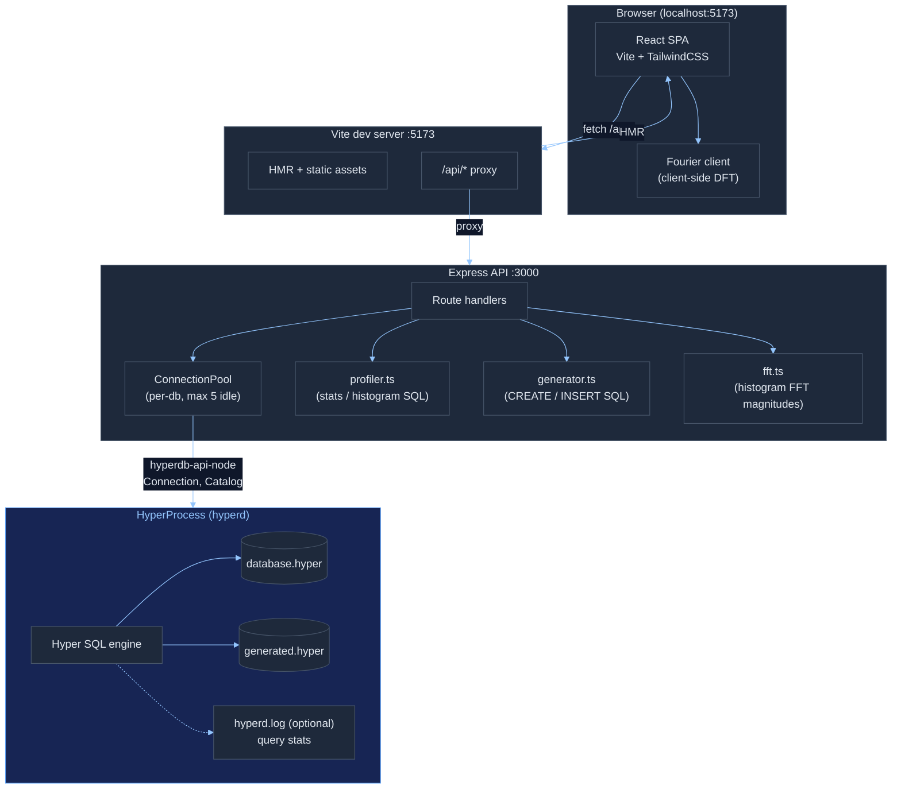
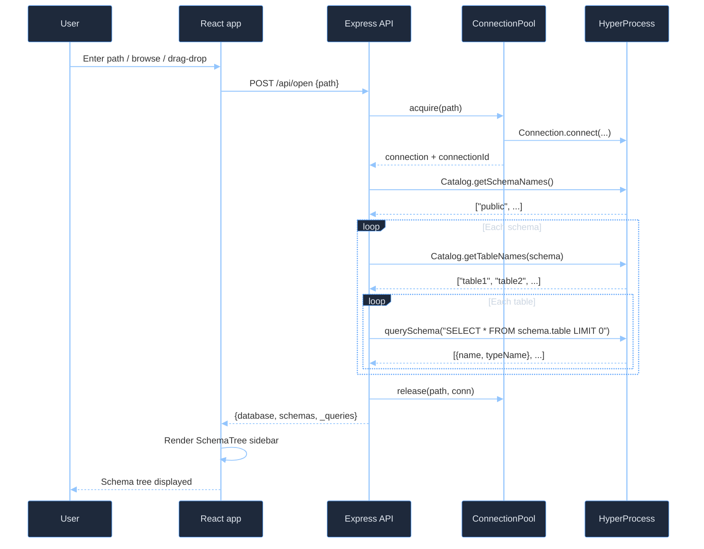
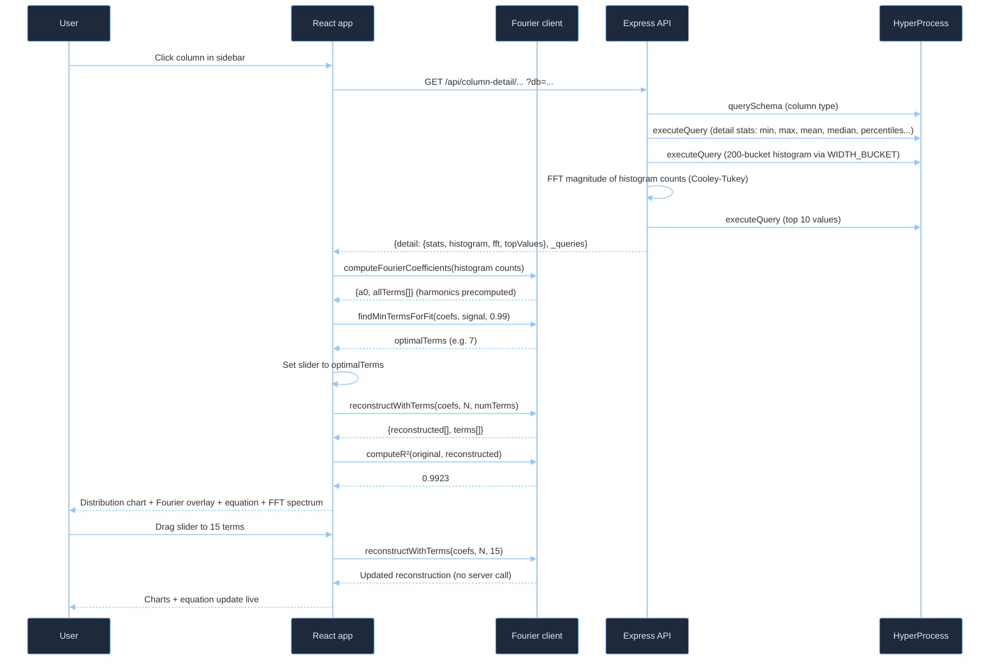
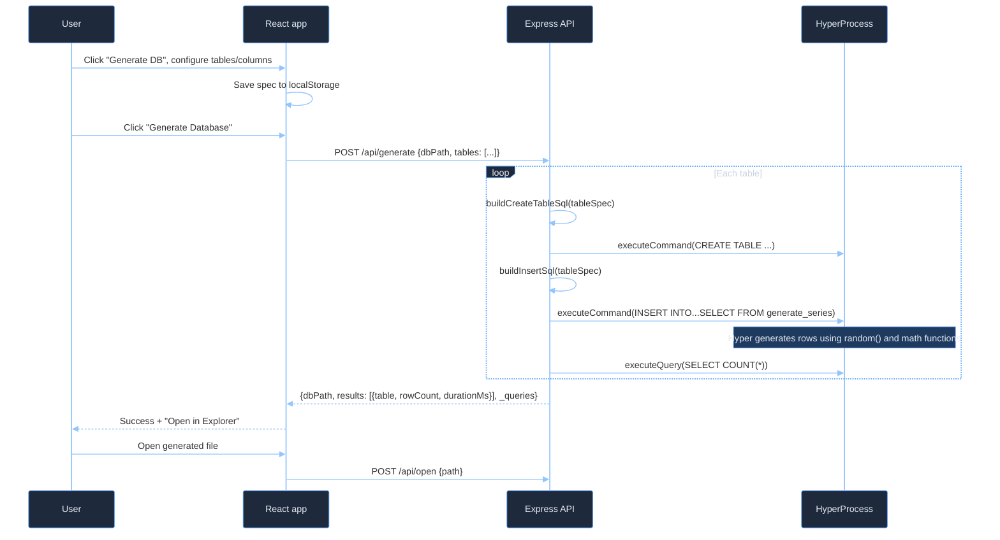

# Hyper Explorer

A web-based database inspector and generator for Hyper `.hyper` files. Browse schemas, preview data with server-side sorting and infinite scroll, view column statistics with distribution graphs and Fourier analysis, run ad-hoc SQL, review query history (user and internal Hyper queries) with optional **Hyper query statistics** from `hyperd` logs, and generate new databases with configurable data distributions.

The UI is a React SPA (Vite + Tailwind). The API is Express + TypeScript, backed by **`hyperdb-api-node`** with a small **per-database connection pool** so concurrent browser requests do not block each other.

## Prerequisites

- **Node.js** >= 21  
- **Rust toolchain** (stable) — required to build `hyperdb-api-node` from the workspace when using `file:../../`  
- **`hyperdb-api-node` built** — from the `hyperdb-api-node/` directory:
  - Release: `npm run build` (faster runtime)
  - Debug: `npm run build:debug` (faster compile while iterating on Rust)
- **`hyperd`** — set the **`HYPERD_PATH`** environment variable to the `hyperd` executable (same as the rest of this repo)

## Quick start

```bash
cd hyperdb-api-node/examples/hyper-explorer
npm install
HYPERD_PATH=/path/to/hyperd npm run dev
```

**Windows (PowerShell):**

```powershell
cd hyperdb-api-node\examples\hyper-explorer
npm install
$env:HYPERD_PATH = "C:\path\to\hyperd.exe"
npm run dev
```

Open **http://localhost:5173** in your browser.

The dev script runs two processes (via `concurrently`):

| Process | Port | Role |
|--------|------|------|
| **Vite** | **5173** | React app + HMR; proxies `/api/*` to Express |
| **Express** | **3000** | REST API, `HyperProcess`, connection pool |

Override the API port with **`PORT`** (default `3000`). The Vite proxy in `vite.config.ts` targets `http://localhost:3000` — if you change `PORT`, update the proxy target to match.

### npm scripts

| Script | Description |
|--------|-------------|
| `npm run dev` | Express (`tsx watch`) + Vite together (recommended) |
| `npm run dev:server` | API only on `PORT` / 3000 |
| `npm run dev:client` | Vite only on 5173 (expects API already running) |
| `npm run build` | Production build of the React app → `dist/` |
| `npm start` | Run `server/index.ts` with `tsx` (API only; does not serve `dist/`) |

For a static deployment, run `npm run build`, host `dist/` behind any static file server, and point `/api` at the Express process (same proxy idea as Vite).

## System architecture



## Backend: connection pool and query statistics

- **Single `HyperProcess`** is created when the server starts (`server/index.ts`). All routes share it.
- **`ConnectionPool`** (`server/routes.ts`) keeps up to **five idle connections per database path**, reuses them across requests, and assigns each connection a stable **numeric ID** (shown in Query History as **Conn**).
- When `HyperProcess` exposes a **`logPath`**, new pooled connections call **`enableQueryStats`** with that path so Hyper can attach engine metrics to queries. Those metrics are returned on tracked queries and surfaced in the UI via **`QueryStatsTooltip`** (hover the duration in Query History or after running SQL in the editor).
- Responses that execute SQL may include **`_queries`**: an array of internal `{ sql, rowCount, durationMs, source, connectionId, queryStats? }`. The frontend **`api.ts`** forwards these to **`setOnInternalQueries`**, which fills **Query History** alongside user runs.

If `hyperd.log` is unavailable, stats collection is skipped gracefully; the app still works with wall-clock `durationMs` only.

## Request flow: opening a database



## Request flow: column detail + Fourier analysis



## Request flow: generating a database



## Features

### Header and navigation

- **Generate DB** — full-screen generator (toggles with **Back to Explorer**).
- **Query History** — full-screen log; button shows **`(N)`** when entries exist.
- **Query Editor** — full-screen SQL workspace; **disabled until a database is open** (unlike the per-table **SQL Editor** tab).
- **Current path** — truncated path shown in the header when a DB is open (explorer mode).

### Database explorer

- **Schema tree** — collapsible schemas → tables → columns (types and nullable metadata from `LIMIT 0` schema queries).
- **Tabs** — **Preview**, **Column Stats**, dynamic tab named after the selected column (column detail), **SQL Editor** (for the selected table).
- **Data preview** — infinite-scroll grid (200-row pages), read-ahead near 50% scroll, **server-side sorting** (click header: asc → desc → clear); issues `ORDER BY` on Hyper.
- **Column stats** — per-column cards (table-level view).
- **Column detail** — sidebar column click; deep analysis for numerics (histogram, Fourier, FFT spectrum, top values, box plot), text, boolean, dates.
- **SQL editor (tab)** — same editor component as full-screen mode: **⌘/Ctrl+Enter** to run, auto **SELECT** vs **command**, timing with optional **query stats tooltip**, results grid or command summary, **schema-aware example query** chips when the editor is empty.
- **Query history** — chronological table: source badge (**user** vs internal **`source`** string), **Conn** `#id`, truncated SQL (click → modal with **sql-formatter** PostgreSQL layout + syntax highlighting + **Copy formatted**), wall-clock duration (**hover** → Hyper metrics when available), timestamp.
- **File browser** — directories and `.hyper` files; **size** and **last modified**; remembers last directory in **localStorage**; modal with pinned **`..`** parent row.
- **Drag and drop** — drop `.hyper` files or plain-text paths onto the page; **full-screen overlay** while dragging.

### Column statistics (table view)

| Data type | Statistics |
|-----------|--------------|
| **All types** | Row count, null count/%, distinct count, cardinality % |
| **Numeric** (INT, DOUBLE, …) | Min, max, mean, median, std dev, CV%, variance, sum, p10/p25/p75/p90 |
| **Text** | Min/max/avg length, top values |
| **Boolean** | True/false counts and percentages |
| **Date / timestamp** | Min, max |

### Numeric column visualizations (column detail)

- **Value distribution** — smooth area chart (200 buckets, monotone cubic spline).
- **Fourier series overlay** — reconstructed curve over the histogram.
- **Interactive slider** — number of Fourier terms (1 … max harmonics).
- **Auto fit** — slider initializes to the smallest term count with R² ≥ 99%.
- **Live R²** — color-coded fit quality.
- **Fourier equation** — expanded series with coefficients.
- **Coefficient table** — n, aₙ, bₙ, amplitude + mini bars.
- **Percentile box plot** — min / p10 / p25 / median / p75 / p90 / max.
- **FFT spectrum** — frequency magnitudes from server-side FFT of bucket counts.
- **Top values** — horizontal bar chart with percentages.

### Database generator

- **Configurable tables** — names, row counts, add/remove.
- **Column editor** — SQL type, distribution, nullable %, parameters.
- **Eight SQL types** — INT, BIGINT, SMALLINT, DOUBLE PRECISION, TEXT, BOOLEAN, DATE, TIMESTAMP.
- **Eleven distributions** — sequential, uniform, normal, lognormal, exponential, bimodal, categorical (Zipf), uuid, words, bernoulli, uniform_range.
- **Inline parameters** — mean, stddev, min, max, lambda, categories, etc.
- **localStorage** — generator spec persistence.
- **Fast inserts** — `INSERT … SELECT … FROM generate_series()` with Hyper **`random()`** (on the order of millions of rows in a few seconds on typical hardware).

## Project structure

```
hyper-explorer/
├── server/                      # Express backend (TypeScript, tsx)
│   ├── index.ts                 # Express, CORS, JSON, HyperProcess, pool, PORT, shutdown
│   ├── routes.ts                # REST handlers, ConnectionPool, tracked connections, _queries
│   ├── profiler.ts              # SQL for column stats, histograms, detail
│   ├── generator.ts             # CREATE/INSERT generation from spec
│   └── fft.ts                   # Radix-2 Cooley-Tukey FFT (histogram spectrum)
│
├── src/                         # React frontend
│   ├── main.tsx
│   ├── App.tsx                  # Layout, tabs, pool-driven loading, global drag-drop
│   ├── api.ts                   # fetch helpers, _queries fan-out, types (incl. QueryStats)
│   ├── fourierClient.ts         # Client DFT, reconstruction, R², term selection
│   └── components/
│       ├── FileOpener.tsx
│       ├── SchemaTree.tsx
│       ├── DataGrid.tsx
│       ├── ColumnStats.tsx
│       ├── ColumnDetailView.tsx
│       ├── SqlEditor.tsx
│       ├── QueryHistory.tsx
│       ├── QueryStatsTooltip.tsx
│       └── GenerateDatabase.tsx
│
├── package.json                 # hyperdb-api-node: file:../../
├── vite.config.ts               # dev server + /api → :3000
├── tsconfig.json
├── tailwind.config.js
├── postcss.config.js
└── index.html
```

## API reference

All data routes (except browse/open/close/generate-meta) require the **`db`** query parameter or body field set to the absolute path of the open `.hyper` file.

| Method | Path | Description |
|--------|------|-------------|
| `GET` | `/api/browse?dir=` | List directories and `.hyper` files (optional `dir`, default home); items include `size`, `lastModified` |
| `POST` | `/api/open` | Body `{ path }` — schema tree; may include `_queries` |
| `POST` | `/api/close` | Body `{ path }` — close pooled connections for that path |
| `GET` | `/api/preview/:schema/:table?db=&limit=&offset=&sortColumn=&sortDir=` | Paginated rows + `totalRowCount`; `limit` capped at **1000**; optional `sortColumn` / `sortDir` (`asc`/`desc`); `_queries` |
| `GET` | `/api/stats/:schema/:table?db=` | Per-column statistics; `_queries` |
| `GET` | `/api/column-detail/:schema/:table/:column?db=` | Detail payload + `_queries` |
| `POST` | `/api/query` | Body `{ db, sql }` — SELECT → rows + columns; otherwise command; returns `durationMs`, optional `queryStats`, `_queries` |
| `GET` | `/api/generate-meta` | Supported types and distributions |
| `POST` | `/api/generate` | Body `{ dbPath, tables: [...] }` — create DB; `_queries` |

## Tech stack

- **Backend** — Express 4, TypeScript, **`tsx`** (watch in dev), **`hyperdb-api-node`** (N-API bindings to the Rust Hyper client).
- **Frontend** — React 18, **Vite 7**, TailwindCSS 3, **`sql-formatter`** (PostgreSQL dialect).
- **Math** — Radix-2 FFT on the server for spectrum data; client-side DFT / Fourier reconstruction / monotone cubic splines (Fritsch–Carlson).
- **Concurrency** — `ConnectionPool` + tracked wrappers attach `queryStats` when the log path is known.

## Independence

The example is self-contained aside from:

- **`hyperdb-api-node`** — `file:../../` in `package.json` (swap for a published package if you ship it).
- **`hyperd`** — pointed to by **`HYPERD_PATH`**.

## Notes

- **`npm run build`** may print a Vite warning about large JS chunks; it is informational and does not fail the build.
- **`lucide-react`** is listed as a dev dependency for optional icon work; the current UI uses inline SVG where needed.
