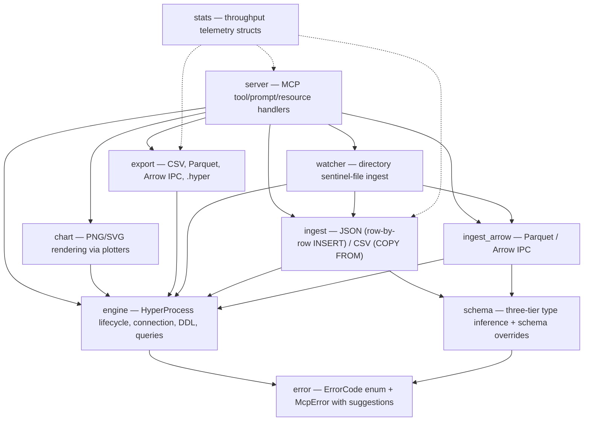

# hyperdb-mcp Development Guide

Contributor-facing documentation for the `hyperdb-mcp` crate. For user-facing docs (installation, tool reference, troubleshooting), see [README.md](README.md).

---

## Architecture

The crate is layered bottom-up. Each module has a single responsibility and depends only on modules below it:



### Module Map

| File | Responsibility |
|------|---------------|
| `src/main.rs` | CLI arg parsing (clap), tracing setup, tokio runtime bootstrap |
| `src/lib.rs` | Crate root — re-exports all public modules |
| `src/error.rs` | `ErrorCode` enum, `McpError` struct, `hyperdb_api::Error` → `McpError` conversion |
| `src/stats.rs` | `IngestStats`, `QueryStats`, `ExportStats` — telemetry attached to every response |
| `src/schema.rs` | Three-tier schema inference (exact/structural/heuristic), type mapping, schema overrides |
| `src/engine.rs` | `Engine` — owns `HyperProcess` + `Connection`, table CRUD, query execution, transactions |
| `src/ingest.rs` | Inline JSON/CSV ingest into Hyper tables |
| `src/ingest_arrow.rs` | Parquet and Arrow IPC file ingest |
| `src/export.rs` | Export to CSV, Parquet, Arrow IPC, `.hyper` files |
| `src/chart.rs` | SQL → chart rendering (bar/line/scatter/histogram) via `plotters` |
| `src/watcher.rs` | Directory watcher for incremental ingest via `.ready` sentinel protocol |
| `src/server.rs` | MCP server: tool definitions, prompt definitions, resource handlers |

---

## Design Decisions

### Sentinel-File Protocol for Watchers

The `watch_directory` tool uses a `.ready` companion file instead of watching for data files directly. This solves the partial-write problem: filesystem events fire during writes, not after them. The `.ready` file is a zero-byte atomic signal that the data file is complete. See `src/watcher.rs` module docs for the full protocol.

### Sync Hyper Calls in an Async Server

The `Engine` uses `hyperdb-api`'s synchronous `Connection` API. The MCP server runs on tokio, but `rmcp` dispatches tool handlers where blocking is safe. Moving to `spawn_blocking` or an async connection API is a possible future optimization but not required for correctness today. See `src/engine.rs` module docs.

### Three-Tier Schema Inference

Rather than requiring users to declare schemas, the crate infers types from the data:

1. **Exact** (Arrow/Parquet) — types from file metadata, zero guessing.
2. **Structural** (JSON) — full scan of all objects with type widening.
3. **Heuristic** (CSV) — first 1,000 rows sampled; ambiguous columns default to TEXT.

The widening chain and rules are documented in `src/schema.rs` module docs. The `schema` parameter on every tool lets callers override inference when needed.

### Lazy Engine Initialization

The `HyperProcess` (which spawns `hyperd`) is not started during the MCP handshake. It starts on the first tool call. This keeps `initialize` fast and avoids starting a database process the client may never use.

### Connection Recovery

When `hyperd` crashes or the wire protocol falls out of sync, `with_engine` in `src/server.rs` detects `ConnectionLost`, drops the engine, and the next call transparently reconnects. The classifier in `src/error.rs` (`is_connection_lost`) covers both transport failures and the `"desynchronized"` state from bounded drain exhaustion.

### Query vs Execute Split

The `query` tool only accepts read-only SQL (`SELECT`/`WITH`/`EXPLAIN`/`SHOW`/`VALUES`). The `execute` tool handles DDL/DML. This gives the LLM an explicit mutation boundary and enables `--read-only` deployment where `execute` is blocked entirely.

### Transactional Ingest Atomicity

Every ingest function (`ingest_json`, `ingest_csv`, `ingest_parquet_file`, `ingest_arrow_ipc_file`, `ingest_csv_file`, `ingest_json_file`) wraps its INSERT / COPY work inside `Engine::execute_in_transaction`. A mid-ingest failure rolls back every row from the same call so callers never see partial batches.

Three edges to this guarantee, all documented in `src/engine.rs`:

1. **DDL auto-commits.** Hyper commits `CREATE TABLE` / `DROP TABLE` immediately, regardless of the surrounding transaction. In `replace` mode the original table is already gone by the time INSERTs start, so a failed replace-mode ingest leaves an empty table rather than restoring the original. Append mode is fully atomic because it issues DDL only when the target doesn't exist and, when it does, no data is lost on failure.
2. **Panic safety.** `execute_in_transaction` wraps the closure in `catch_unwind(AssertUnwindSafe(...))`, issues a best-effort ROLLBACK on panic, and `resume_unwind`s the original payload. Without this, a panic inside the closure (unwrap on None, indexing OOB, arithmetic overflow) would leave an open transaction and every subsequent tool call would hit "transaction already in progress" — classified as `InternalError`, not `ConnectionLost`, so the reconnect path at `with_engine` would not rescue it and the engine would stay wedged until restart. Tested via `execute_in_transaction_rolls_back_on_panic` in `tests/transaction_tests.rs`.
3. **Post-error wire-protocol quirk.** After a mid-transaction Hyper-level error (e.g. a NOT NULL violation on INSERT), the first SELECT after rollback may return an empty result set due to residual bytes on the connection. Retrying the query once restores normal behavior; the rollback itself is always correct. The `query_resilient` helper in `tests/transaction_tests.rs` is the robust pattern.

---

## Building and Testing

### Prerequisites

- Rust toolchain (see `rust-version` in `Cargo.toml`)
- `hyperd` binary — set `HYPERD_PATH` or place on `PATH`

### Build

```bash
cargo build -p hyperdb-mcp
cargo build --release -p hyperdb-mcp
```

### Test

```bash
cargo test -p hyperdb-mcp
```

Most tests require a running `hyperd`. Set `HYPERD_PATH` before running.

### Lint

```bash
cargo clippy -p hyperdb-mcp
cargo fmt -p hyperdb-mcp -- --check
```

### Running the Demo

The `examples/demo.rs` exercises the engine API end-to-end: ingest a synthetic CSV, describe, sample, aggregate, rank, and render charts.

```bash
HYPERD_PATH=/path/to/hyperd cargo run --example demo -p hyperdb-mcp
```

Outputs land in `hyperdb-mcp/demo_output/`:
- `coder_stats.csv` — the synthetic input dataset
- `happiness_over_time.png` — line chart
- `coffee_vs_bugs.png` — scatter chart

---

## Adding a New MCP Tool

1. **Define a parameter struct** in `src/server.rs`. Derive `Debug`, `Deserialize`, `JsonSchema`. Field doc comments become JSON Schema descriptions in the MCP `tools/list` response — write them for the LLM caller.

2. **Add the tool method** in the `#[tool_router] impl HyperMcpServer` block. Use the `#[tool(description = "...")]` attribute. Follow the existing pattern: call `self.with_engine(|engine| { ... })` for database work.

3. **Handle read-only mode** if the tool mutates state: call `self.check_writable("tool_name")` at the top.

4. **Return results** via `Self::ok_content(json_value)` for success or `Self::err_content(mcp_error)` for errors.

5. **Add telemetry**: use `StatsTimer` and include a `stats` field in the response JSON.

6. **Update README.md**: add the tool to the MCP Tools section with a parameter table.

## Adding a New MCP Prompt

1. **Define an argument struct** in `src/server.rs`. Derive `Debug`, `Deserialize`, `JsonSchema`.

2. **Add the prompt method** in the `#[prompt_router] impl HyperMcpServer` block. Use `#[prompt(name = "...", description = "...")]`.

3. **Return a `Vec<PromptMessage>`** with a user message (the analytical task) and an assistant message (acknowledging the task). Use `build_analyze_context` or `build_brief_context` to embed live schema/sample data.

4. **Update README.md**: add the prompt to the MCP Prompts table.

---

## Error Code Architecture

Every error carries a machine-readable `ErrorCode` (serialized as `SCREAMING_SNAKE_CASE`) and a human-readable message. Most codes also get a default `suggestion` string aimed at the LLM — it tells the model how to self-correct without a round-trip to the user.

The `From<hyperdb_api::Error>` impl in `src/error.rs` classifies Hyper errors by sniffing the message text. `is_connection_lost` detects both transport failures and wire-protocol desync. See the function-level docs in `src/error.rs` for the full classifier.

---

## Performance Telemetry Internals

Every tool response includes a `stats` object. The stats structs in `src/stats.rs` capture raw counters and derive throughput metrics via `to_json()`:

- **`IngestStats`** — rows, elapsed, bytes_read, bytes_stored; derives `rows_per_sec`, `ingest_throughput_mb_sec`, `compression_ratio`.
- **`QueryStats`** — rows_returned, rows_scanned, elapsed; derives `scan_rate_rows_sec`.
- **`ExportStats`** — rows, elapsed, file_size_bytes; derives `rows_per_sec`.

Derived fields are merged into the serialized JSON so callers get a self-contained stats object without computing anything.

---

## Two-Database Engine Model

Every `Engine` holds:

- **Ephemeral primary** at `$TMPDIR/hyperdb-mcp-<pid>-<seq>/scratch.hyper`. Created fresh on each `Engine::new` (`<seq>` is a process-wide atomic so parallel test runners and restart-after-ConnectionLost reconnects get distinct files). The connection is *bound* to this database — unqualified SQL routes here. `Engine::drop` always deletes the per-engine temp directory.
- **Persistent attachment** under the alias `"persistent"`. When `Engine::new(Some(path))` is called, the engine runs `CREATE DATABASE IF NOT EXISTS '<path>'` (creating the file if missing) and `ATTACH DATABASE '<path>' AS "persistent"`. Then `SET schema_search_path = '<primary_db>'` keeps unqualified resolution routing into the ephemeral primary. `Engine::new(None)` skips this step (the `--ephemeral-only` mode); `engine.has_persistent()` reflects which mode was selected.

Catalog and saved-queries meta-tables live in the persistent attachment, qualified via `"persistent"."public"."_table_catalog"` etc. When the engine has no persistent attachment, those operations no-op. See `crate::table_catalog::qualified_catalog` and `crate::saved_queries::WorkspaceStore::qualified_table` for the routing helpers.

Logs land next to the persistent file when one is supplied (so users find them in a stable per-project location); ephemeral-only sessions log to `$TMPDIR/hyperdb-mcp-<pid>/`. The `status` tool reports `ephemeral_path`, `persistent_path`, and `has_persistent` so operators can confirm where data lives.

## Daemon Mode Internals

`Engine::new` defaults to *daemon mode* — it tries `daemon::spawn::ensure_daemon()` first, which discovers an existing daemon via `~/.hyperdb/daemon.json` (overridable via `HYPERDB_STATE_DIR`) or auto-spawns one as a detached background process. The Engine then connects via TCP (`Connection::connect(endpoint, …)`) without owning any `HyperProcess`.

Falls back to local mode (per-session `hyperd` via `HyperProcess::new`) when the daemon can't be reached, or always when `--no-daemon` is passed.

Cross-platform single-instance lock is the daemon's TCP health port — bind succeeds for exactly one process per user. Liveness is validated by the discovery flow before trusting the file: a stale `daemon.json` (daemon crashed) is detected and removed.

The daemon's main loop tracks idle time via `DaemonState::last_activity`. `HEARTBEAT` commands from active clients reset the timer; clients debounce these to once per 60 seconds in `HyperMcpServer::with_engine`. Idle timeout (default 30 min) triggers graceful shutdown: discovery file removed → `hyperd` dropped → health listener exits.

### hyperd liveness monitoring and restart

A second monitor task in `run.rs::hyperd_monitor` polls the owned `HyperProcess` every 5 seconds via `HyperProcess::has_exited` (a `Child::try_wait()` call — zero SQL, correct on Unix and Windows, reaps zombies as a side effect). When the process is detected dead — or when a client sends `REPORT_HYPERD_ERROR` to the health port via `daemon::health::report_hyperd_error_to_daemon` — the monitor enters `try_restart_hyperd`:

1. Prune the rolling restart-history vector to entries within `RESTART_WINDOW` (60s); reject if `RESTART_LIMIT` (3) attempts have already happened.
2. Drop the old `HyperProcess` (its `Drop` impl waits up to 5s for graceful shutdown — near-instant for an already-exited process).
3. Spawn a replacement via `HyperProcess::new` with the same parameters as initial startup.
4. Update the shared `Arc<Mutex<DaemonInfo>>` with the new endpoint (the health listener reads through the same Arc, so `STATUS` reports the current endpoint).
5. Atomically rewrite `daemon.json` via the existing temp-and-rename in `discovery::write_discovery_file`.

After a successful restart, the monitor drains the restart-request flag once more — any `REPORT_HYPERD_ERROR` that landed *during* the restart was complaining about the now-replaced hyperd, not the freshly spawned one, and would otherwise trigger a spurious double-restart.

When the rate limit is exceeded, the monitor returns; the main task observes that the `tokio::select!` branch completed, requests shutdown, and `hyperd_state` is dropped via Arc refcount as `run_daemon` returns.

### Client-side recovery

Existing engine recovery is unchanged: `HyperMcpServer::with_engine` drops the engine on `ConnectionLost` (server.rs around line 1085); the next tool call calls `Engine::new` → `try_daemon_mode` → re-reads `daemon.json` → connects to whatever endpoint is currently published. After a hyperd restart, the discovery file has the new endpoint, so reconnection happens transparently.

Two new code paths fire `report_hyperd_error_to_daemon` (best-effort, 200ms timeouts so the user-facing tool handler isn't stalled):

- After detecting `ConnectionLost` in `with_engine`.
- When `Connection::connect` to the daemon's advertised endpoint fails in `Engine::try_daemon_mode`.

### Known limitations

- **Hung-but-alive `hyperd`** (TCP listening, but unresponsive to queries) is NOT detected. The monitor's `try_wait()` returns `None` for a hung process; client tool calls hang on the read side without producing a `ConnectionLost` error. Operator recovery is `hyperdb-mcp daemon stop` followed by reconnect.
- **Watchers** auto-recover from hyperd restarts: when an ingest fails with a connection-lost error, the watcher rebuilds its connection pool against the engine's current endpoint and retries the file once. Persistent failures (the second attempt also fails) fall through to the standard `failed/` move so a single broken file can't keep the watcher pinned in retry loops.

See `src/daemon/{mod,discovery,health,run,spawn}.rs` for the full implementation.

---

## Known Tech Debt / Future Work

- **Row-by-row INSERT for Parquet/Arrow**: `ingest_arrow.rs` reads Arrow batches but inserts one row at a time via SQL. Using the binary COPY protocol or an Arrow inserter would improve throughput significantly.
- **Parquet export via JSON roundtrip**: `export.rs` materializes query results as JSON, converts to Arrow, then writes Parquet. A direct Arrow-to-Parquet path would avoid the JSON intermediate.
- **No streaming for large JSON results**: `execute_query_to_json` accumulates all rows in memory. For huge results, callers should use `export` instead.
- **CSV schema inference reads entire file**: `ingest_csv_file` reads the whole file for inference, then `COPY FROM` reads it again. A single-pass approach would halve I/O.
- **No `spawn_blocking`**: Engine calls are synchronous in an async runtime. Works today because `rmcp` handles dispatch, but explicit `spawn_blocking` would be more robust.
- **Watcher thread per directory**: Each `watch_directory` call spawns a dedicated OS thread. For many concurrent watchers, a shared thread pool would be more efficient.
- **Single shared `Connection`**: `Engine` owns exactly one `Connection` to `hyperd`, and every tool call serializes on an `Arc<Mutex<Option<Engine>>>`. `hyperd` itself can handle many concurrent connections, so a `Connection` pool (or a dedicated watcher-thread `Connection`) would stop a long-running ingest from blocking unrelated tool calls.
- **`list_changed` is not fired on append-mode table creation**: Both `load_*` append mode and `watch_directory` auto-create the target table via `CREATE TABLE IF NOT EXISTS` when it doesn't exist, but neither path plumbs a "created vs existed" signal back from the ingest layer, so clients subscribed to `hyper://tables` miss the new entry until they rescan. The fix is to have `create_table` report whether it actually created vs. no-oped, bubble that up through the ingest return, and have both callers fire `notify_list_changed` only when a new table appears.

---

## Forward-Looking Design Notes

Feature-level ideas that aren't bugs or tech debt (which are tracked above) — cross-database tools, catalog awareness for attached databases, `switch_workspace`, and cross-workspace data-movement fallbacks — now live in [ROADMAP.md](ROADMAP.md). That split keeps this file focused on the current codebase and how to work in it, while ROADMAP.md captures the "not built yet but worth thinking about" material.

---
